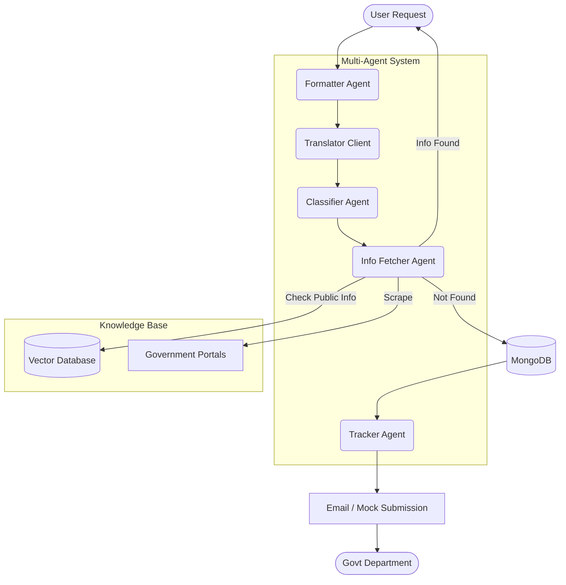

<div align="center">
  
  
  
  
</div>

<h1 align="center">RTI Agent</h1>
<p align="center"><b>AI-Powered Right to Information (RTI) Automation for India</b></p>

## 📌 Executive Summary & Value Proposition
**RTI Agent** is an intelligent, multi-agent automation system designed to streamline the Right to Information (RTI) process in India. By leveraging Large Language Models (LLMs) and advanced agent orchestration, this system simplifies the end-to-end journey of an RTI request—from query formulation to department classification, information retrieval, and tracking.

**Value Proposition:**
- **For Citizens:** Drastically reduces the complexity of drafting RTI requests, breaks language barriers with multilingual support, and proactively finds public info without waiting the typical 30-day period.
- **For Government Departments:** Minimizes duplicate and unnecessary requests by intercepting queries where information is already public, and ensures requests are correctly formatted and routed.

---

## 🏗️ Architecture
The core workflow engine is built using **LangGraph**, enabling scalable orchestration of modular agents.



---

## ✨ Key Features
- **Multi-Agent Orchestration:** Specialized agents handle formatting, translation, classification, info-fetching, and tracking.
- **Multilingual Support:** Process queries in multiple Indian languages (Hindi, Marathi, etc.) utilizing translation and transliteration.
- **RAG & Knowledge Base:** Incremental ingestion from PDFs, HTML, and government sites, coupled with OCR and semantic search.
- **Proactive Interception:** Scans government portals and local vector stores to deliver instant answers if the data is already public.
- **Security & Guardrails:** PII masking, response sanitization, and hallucination detection to ensure privacy and safety.
- **Observability:** Built-in LangSmith integration, Prometheus metrics, and Grafana dashboards for monitoring performance.

---

## 🛠️ Tech Stack
- **Frameworks:** LangChain, LangGraph, FastAPI, Next.js
- **LLMs & AI:** Groq (Llama 3), Google Gemini, OpenAI (Fallback)
- **Databases:** MongoDB (Storage), Redis (Semantic Cache), FAISS / MongoDB Atlas (Vector Store)
- **Observability:** Prometheus, Grafana, Structured Logging
- **Infrastructure:** Docker, Docker Compose

---

## 🚀 Quick Start & Setup Instructions

### Option 1: Docker (Recommended)
The easiest way to run the entire stack (App, MongoDB, Redis, Prometheus, Grafana, Frontend).

1. **Clone the repository:**
   ```bash
   git clone https://github.com/akashgaikwad28/RTI_Agents.git
   cd RTI_Agents
   ```

2. **Configure Environment Variables:**
   ```bash
   cp .env.example .env
   # Open .env and add your API keys (GROQ_API_KEY, GEMINI_API_KEY)
   ```

3. **Spin up the containers:**
   ```bash
   docker-compose up --build -d
   ```
   - API: `http://localhost:8000`
   - Frontend: `http://localhost:3001`
   - Grafana: `http://localhost:3000`
   - Prometheus: `http://localhost:9090`

### Option 2: Manual / Local Setup

1. **Prerequisites:**
   - Python 3.11+
   - MongoDB & Redis instances running
   - Node.js (for the frontend)

2. **Install Python Dependencies:**
   ```bash
   python -m venv venv
   source venv/bin/activate  # On Windows: venv\Scripts\activate
   pip install -r requirements.txt
   ```

3. **Environment Setup:**
   ```bash
   cp .env.example .env
   # Update the database URIs and API keys accordingly
   ```

4. **Run the Backend:**
   ```bash
   uvicorn api.main:app --host 0.0.0.0 --port 8000 --reload
   ```

5. **Run the Frontend:**
   ```bash
   cd frontend
   npm install
   npm run dev
   ```

---

## ⚙️ Environment Variables
The application relies on `.env` configuration. Key variables include:

| Variable | Description |
|----------|-------------|
| `GROQ_API_KEY` | Your API key for Groq Cloud. |
| `GEMINI_API_KEY` | Your API key for Google Gemini. |
| `MONGO_URI` | Connection URI for your MongoDB database. |
| `REDIS_URL` | Redis URL for rate-limiting and semantic caching. |
| `APP_ENV` | Sets the application environment (`development` / `production`). |
| `RTI_API_KEY` | Security key for the backend API access. |

_See the [`.env.example`](.env.example) file for all available configurations._

---

## 🤝 Contribution Guidelines
We welcome contributions to make the RTI process more accessible to everyone!

1. **Fork the Repository:** Create your own fork and branch off `main`.
2. **Issue Tracker:** Check the open issues or create a new one to discuss your proposed changes.
3. **Coding Standards:** Follow PEP-8 for Python code. Use clear, descriptive commit messages.
4. **Testing:** Ensure existing tests pass and write new tests for your features.
5. **Pull Requests:** Submit a pull request detailing the changes, and link it to the relevant issue.

---

## 📄 License
This project is licensed under the MIT License - see the [LICENSE](LICENSE) file for details.

> Built with ❤️ to empower transparency and citizen access to public information in India.
