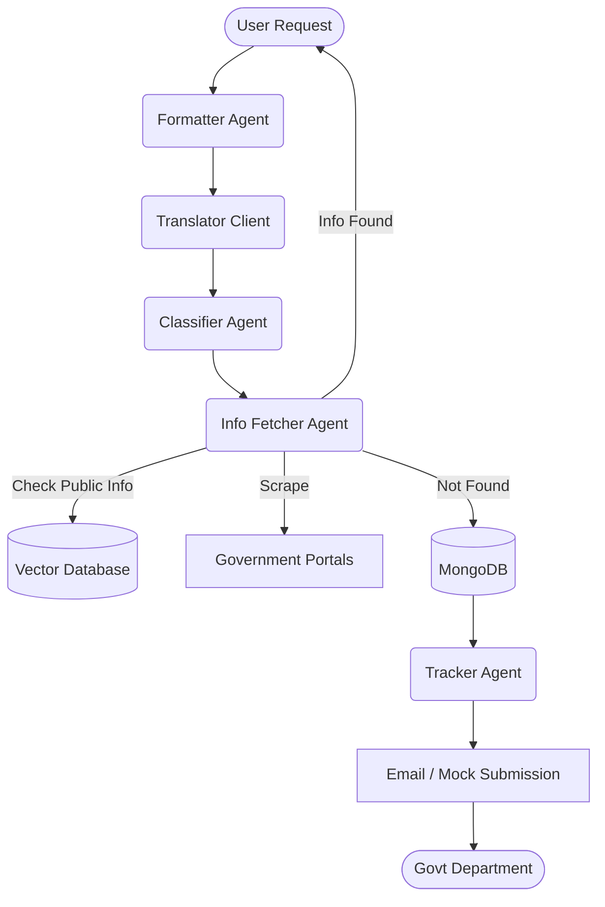

# System Architecture

The core workflow engine is built using **LangGraph**, enabling scalable orchestration of modular agents. The frontend is built with **Next.js**, and the backend is a highly asynchronous **FastAPI** service.

## Core Flow

