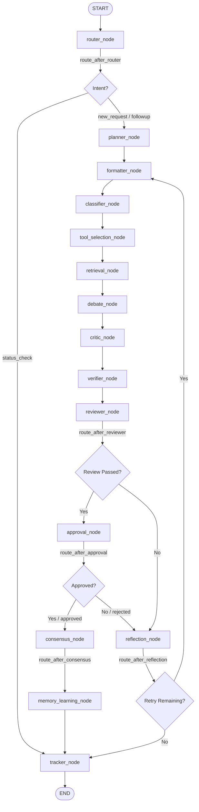
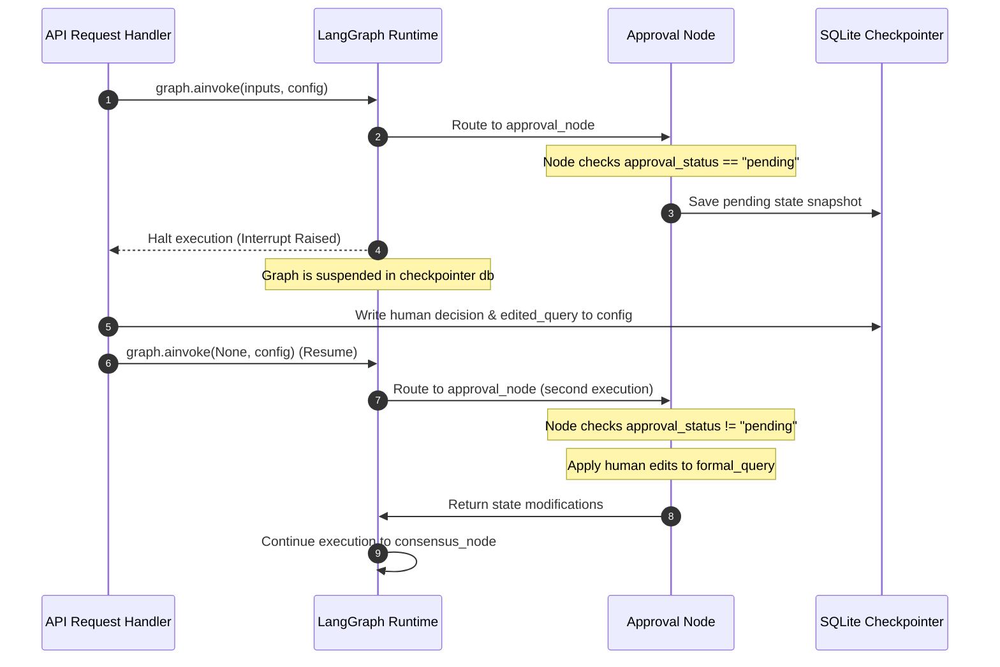
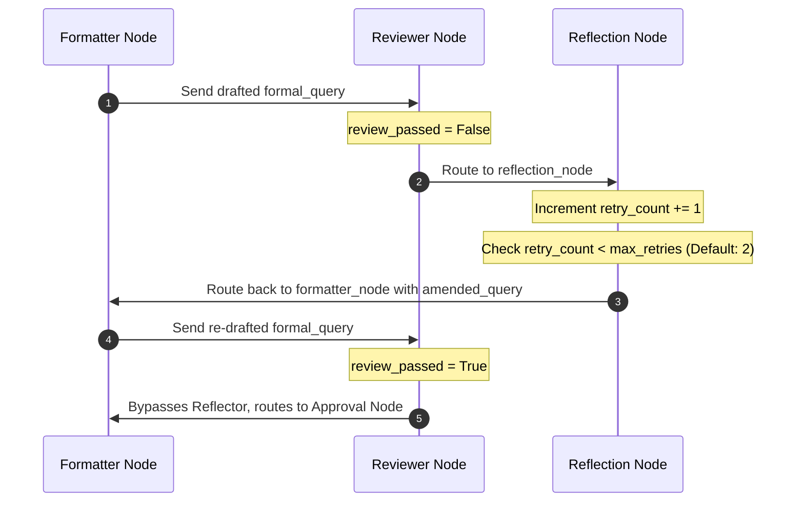

# System Architecture

The RTI Agent leverages a highly modular and extensible architecture designed for complex, autonomous reasoning with strict human in the loop (HITL) oversight. 

## Interactive System Map Diagram

The documentation is organized into five core architectural pillars, establishing cross linked pathways so engineers and administrators can easily navigate the ecosystem.

```mermaid
graph TD
    classDef doc fill:#ececff,stroke:#9370db,stroke-width:1px;
    classDef workflow fill:#dcfce7,stroke:#16a34a,stroke-width:1px;
    classDef index fill:#fef9c3,stroke:#ca8a04,stroke-width:2px;

    INDEX[Overview / README]:::index --> SYSTEM_MAP[System Map]:::index
    SYSTEM_MAP --> AGENTS[Pillar 1: Agent Manuals]
    SYSTEM_MAP --> CORE[Pillar 2: Core Platform]
    SYSTEM_MAP --> GOV[Pillar 3: Governance & Security]
    SYSTEM_MAP --> WALKTHROUGHS[Pillar 4: Workflows & Traces]

    %% Agent Mapping
    AGENTS --> OVERVIEW[AGENT_SYSTEM_OVERVIEW]:::doc
    OVERVIEW --> router[router_agent]:::doc
    OVERVIEW --> planner[planner_agent]:::doc
    OVERVIEW --> formatter[formatter_agent]:::doc
    OVERVIEW --> classifier[classifier_agent]:::doc
    OVERVIEW --> retrieval[retrieval_agent]:::doc
    OVERVIEW --> reviewer[reviewer_agent]:::doc
    OVERVIEW --> reflection[reflection_agent]:::doc
    OVERVIEW --> approval[approval_agent]:::doc
    OVERVIEW --> tracker[tracker_agent]:::doc

    %% Core Platform Mapping
    CORE --> graph_flow[LANGGRAPH_EXECUTION_FLOW]:::doc
    CORE --> state[STATE_ARCHITECTURE]:::doc
    CORE --> memory[MEMORY_ARCHITECTURE]:::doc
    CORE --> tools[TOOL_CALLING_ARCHITECTURE]:::doc
    CORE --> rag[RAG_RETRIEVAL_FLOW]:::doc

    %% Governance & Telemetry Mapping
    GOV --> hitl[HITL_GOVERNANCE_FLOW]:::doc
    GOV --> security[SECURITY_ARCHITECTURE]:::doc
    GOV --> observability[OBSERVABILITY_ARCHITECTURE]:::doc
    GOV --> inventory[SYSTEM_INVENTORY]:::doc

    %% Walkthroughs Mapping
    WALKTHROUGHS --> trace_std[new_rti_submission_flow]:::workflow
    WALKTHROUGHS --> trace_multi[multilingual_query_flow]:::workflow
    WALKTHROUGHS --> trace_halluc[hallucination_recovery_flow]:::workflow
    WALKTHROUGHS --> trace_pause[approval_resume_flow]:::workflow
    WALKTHROUGHS --> trace_debug[retrieval_debug_flow]:::workflow
```

## LangGraph Execution Flow & Lifecycle Architecture

This details the runtime execution model, node transition logic, conditional routing pathways, and state persistence boundaries of the RTI Agent **LangGraph StateGraph** pipeline.

### StateGraph Compilation & Node Definitions

The RTI Agent workflow is built as an asynchronous state machine where each node acts as a functional transformer of a single shared context state (`RTIAgentState`).

* **Core Compiler**: `graph/graph_builder.py`
* **Checkpointer Engine**: LangGraph SQLite checkpointer (`SqliteSaver` in SQLite `data/checkpoints/rti_checkpoints.db`)

### Transition Logic & Conditional Edges

Node routing is managed via central edge router functions rather than within individual agents. This keeps the nodes focused solely on processing text and data.

## Human in the Loop (HITL) Interrupts

The graph enforces human governance via LangGraph's native thread interruption mechanism:
\`\`\`python
graph = builder.compile(
    checkpointer=checkpointer, 
    interrupt_before=["approval_node"] if enable_hitl else []
)
\`\`\`

### Pause and Resume Sequence

## Cyclic Loops & Self Correction

When a draft fails review or is rejected, the graph loops back from the `reflection_node` to the `formatter_node` to draft an improved version based on feedback.

### Retry Sequence Diagram

