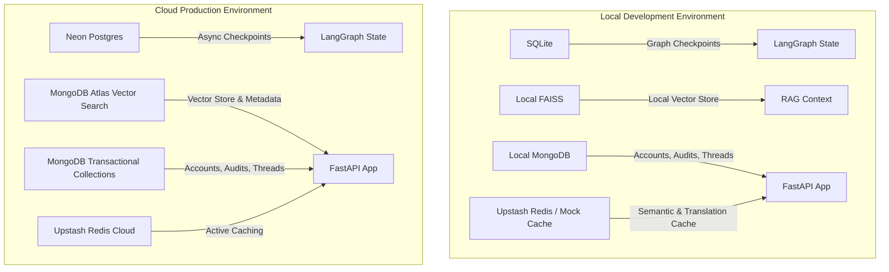

# System Database & Storage Architecture

This manual details the hybrid database and storage architecture implemented across the RTI Agent project, outlining the differences between Local Development and Cloud Production configurations.

---

## 📌 Database Topology Overview

The RTI Agent leverages a multi database topology to satisfy distinct system requirements: transactional persistence, semantic search, high speed caching, and agent state checkpointing.

---

## 🛠️ Database Matrix (Development vs. Production)

| Database | Role | Local Development | Cloud Production | What is Stored |
| :--- | :--- | :--- | :--- | :--- |
| **MongoDB** | Primary Document & Vector Store | Local MongoDB Community Edition | MongoDB Atlas (Shared Cluster) | Users, Active RTIs, Chat Threads, Audit Logs, Vector Chunks (`vector_chunks` collection) |
| **Redis** | Semantic & Translation Cache | Local Mock or Upstash Redis | Upstash Redis Cloud | Query embeddings to Response JSON mappings, translation caches |
| **FAISS** | Local RAG Search | Local FAISS Index files on disk | *Bypassed* (Uses MongoDB Vector Search) | Vector index mappings (`index.faiss`, `index.pkl`, `manifest.json`) |
| **SQLite** | Graph Checkpointer | Local SQLite files (`data/checkpoints/`) | *Bypassed* (Uses PostgreSQL) | Serialized LangGraph state snapshots for pause/resume checkpoints |
| **PostgreSQL** | Cloud Graph Checkpointer | *Bypassed* (Uses SQLite) | Neon Serverless PostgreSQL | Persistent, multi node LangGraph thread checkpoint logs |

---

## 1. MongoDB Architecture (`mcp_clients/mongo_client.py`)
MongoDB acts as our primary async transactional database. We use the **Motor** driver to integrate natively with FastAPI async event loops.

### Key Collections & Schema Purposes:
*   `users`: User profile documents containing unique indexed email IDs, role configurations (`citizen`, `officer`, `admin`), and hashed passwords.
*   `refresh_tokens`: Revocation lists for active JWT auth tokens. Uses a database TTL index on `expires_at` for automatic cleanup.
*   `rti_requests`: High fidelity documents representing RTI filings. Tracks statuses (`pending`, `processing`, `awaiting_approval`, `completed`, `error`), target departments, and generated draft text.
*   `conversation_threads`: Stores chat bot conversations as arrays of message payloads mapped to a unique `thread_id`.
*   `audit_log`: Chronological tracking logs of system mutations (e.g., approvals, submissions).
*   `documents_metadata`: Tracking manifest of RAG source documents, URLs, and unique file content SHA 256 hashes.
*   `translation_memory`: Local mappings of source text to translated output for Indic languages.

### Vector Search Collection (`vector_chunks`):
In production (`VECTORSTORE_TYPE=mongodb`), MongoDB stores our vectorized text chunks inside the `vector_chunks` collection.
*   **Unique Index:** On `chunk_id` to enforce automatic duplicate key rejection (`code 11000`) during crawler bulk imports.
*   **Search Index:** An Atlas search index named `vector_index` mapped to the `embedding` coordinates field path.

---

## 2. Redis Caching Architecture (`rag/vectorstore/semantic_cache.py`)
Redis operates as our high speed cache. It implements two main caching layers:
1.  **Semantic Query Cache:** Stores embeddings of user queries. If a new query falls within a cosine distance threshold of a cached query, the system returns the cached JSON answer instantly.
2.  **Translation Cache:** Caches translations between Indic languages and English.

---

## 3. FAISS Vector Store (`rag/vectorstore/faiss_store.py`)
FAISS is our default local vector storage framework.
*   **Storage Location:** Files are written directly to `data/faiss_index/`.
*   `index.faiss`: Serialized index of vector embeddings coordinates.
*   `index.pkl`: Serialized Python dictionary containing document text chunks matching the index IDs.
*   `manifest.json`: Integrity manifest tracking all imported chunk hashes to prevent duplicate embedding costs.

---

## 4. LangGraph Checkpointers (State Persistence)
To support **Human in the Loop (HITL)**, the graph execution states must be persistent so threads can be paused and resumed later.

### SQLite Checkpointer:
*   **Active in:** Development.
*   **Location:** Local file based databases in the workspace (`CHECKPOINTER_DB` path).
*   **Benefits:** Resilient, lightweight state persistence without database server overhead.

### PostgreSQL Checkpointer (`LazyPostgresCheckpointer`):
*   **Active in:** Production (Render/Vercel).
*   **Benefits:** Relies on **Neon Serverless PostgreSQL** database connection pools. It is necessary in cloud production because cloud dynos have ephemeral file storage; an SQLite file checkpointer would be wiped on every deployment or server restart.
