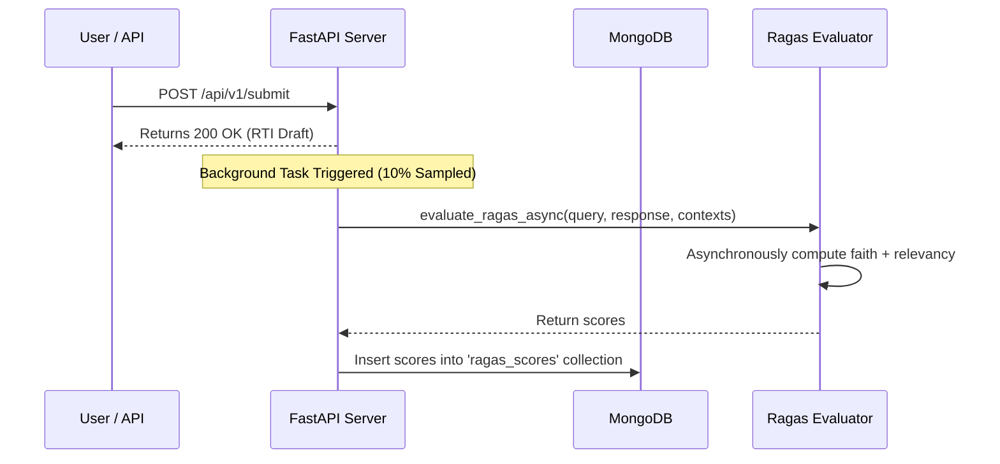

# RAG Evaluation & Benchmarks (RAGAS)

Deploying LLMs in a legal and governmental context requires rigorous evaluation to prevent hallucinations. The RTI Agent incorporates **Ragas v0.4.3** for automated, production grade RAG pipeline auditing.

---

## RAGAS Evaluation Framework

Our implementation leverages the modern, single turn scoring interfaces of Ragas 0.4.3. Rather than loading heavy pandas or HuggingFace datasets, the system uses asynchronous `.ascore()` metric invocations. This allows for lightweight, concurrent, real time evaluation.

### Evaluation Judges Setup
* **Judge LLM**: An `instructor`-patched **Groq** client running `llama-3.3-70b-versatile` as the core reasoning engine.
* **Embeddings Model**: Native Ragas `GoogleEmbeddings` running `text-embedding-004` on the Gemini API.

---

## Implemented Metrics

Depending on the availability of a reference answer (ground truth), the evaluation pipeline runs different metrics:

### 1. Live Query Evaluation (No Ground Truth)
When auditing real time queries in production, we do not have a gold standard reference. We run the following metrics:
* **Faithfulness (Hallucination Check)**: Measures how much the generated response is grounded in the retrieved context. If the response contains claims not present in the context, this score drops.
* **Answer Relevancy**: Evaluates how well the response addresses the user's initial query.

### 2. Offline Benchmarking (With Ground Truth)
During golden dataset evaluation or CI tests, where expert annotated ground truths are available, we compute three additional metrics:
* **Context Precision**: Assesses whether the most relevant documents were ranked at the top of the retrieved chunks.
* **Context Recall**: Verifies whether the retriever successfully fetched all the information necessary to construct the ground truth answer.
* **Answer Correctness**: Compares the generated answer directly against the ground truth for semantic accuracy.

---

## Live Sampling Pipeline

To monitor quality without affecting user latency, the system performs live evaluation sampling:

1. **Background Execution**: Live queries have a **10% sampling chance** where `evaluate_ragas_async` is fired in the background.
2. **Database Persistence**: The resulting scores are persisted in the `ragas_scores` collection in MongoDB alongside the `request_id` and `thread_id`.
3. **Telemetry & Dashboard**: Aggregated averages can be queried via the `/api/v1/eval/metrics` endpoint for real time monitoring.

---

## Golden Dataset & CI/CD Benchmarking

* **Dataset Size**: 500 hand curated government queries and expert validated ideal drafts.
* **CI Target**: If the overall faithfulness score drops below **0.95**, the build is automatically blocked.

