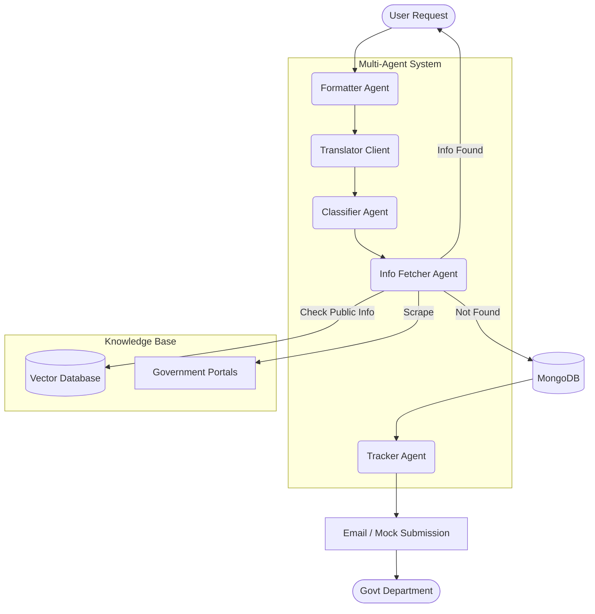

# Introduction

**RTI Agent** is an intelligent, multi agent automation system designed to streamline the Right to Information (RTI) process in India. By leveraging Large Language Models (LLMs) and advanced agent orchestration, this system simplifies the end to end journey of an RTI request from query formulation to department classification, information retrieval, and tracking.

## Value Proposition

- **For Citizens:** Drastically reduces the complexity of drafting RTI requests, breaks language barriers with multilingual support, and proactively finds public info without waiting the typical 30 day period.
- **For Government Departments:** Minimizes duplicate and unnecessary requests by intercepting queries where information is already public, and ensures requests are correctly formatted and routed.

## System Architecture

The core workflow engine is built using **LangGraph**, enabling scalable orchestration of modular agents.



## Tech Stack

- **Frameworks:** LangChain, LangGraph, FastAPI, Next.js
- **LLMs & AI:** Groq (Llama 3), Google Gemini, OpenAI (Fallback)
- **Databases:** MongoDB (Storage), Redis (Semantic Cache), FAISS / MongoDB Atlas (Vector Store)
- **Observability:** Prometheus, Grafana, Structured Logging
- **Infrastructure:** Docker, Docker Compose

## Quick Start & Setup Instructions

### Option 1: Docker (Recommended)
The easiest way to run the entire stack (App, MongoDB, Redis, Prometheus, Grafana, Frontend).

1. **Clone the repository:**
   ```bash
   git clone https://github.com/akashgaikwad28/RTI_Agents.git
   cd RTI_Agents
   ```

2. **Configure Environment Variables:**
   ```bash
   cp .env.example .env
   # Open .env and add your API keys (GROQ_API_KEY, GEMINI_API_KEY)
   ```

3. **Spin up the containers:**
   ```bash
   docker-compose up --build -d
   ```
   - API: `http://localhost:8000`
   - Frontend: `http://localhost:3001`
   - Grafana: `http://localhost:3000`
   - Prometheus: `http://localhost:9090`
