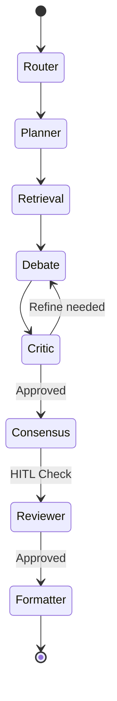

# Agent Orchestration

RTI Agent leverages **LangGraph** to coordinate multiple specialized agents, enabling complex reasoning, retrieval, and verification loops.

## Nodes and Execution Flow

### Router Node (`router_node`)
- **Purpose**: Classifies incoming queries and routes them to the appropriate workflow path.
- **Inputs**: User query, conversation history.
- **Outputs**: Selected workflow path (e.g., `planner`, `direct_response`).
- **Telemetry**: Tracks classification confidence.

### Planner Node (`planner_node`)
- **Purpose**: Breaks down complex requests into a step by step execution plan.
- **Inputs**: Routed query.
- **Outputs**: Sequential plan, sub tasks for retrieval.

### Retrieval Node (`retrieval_node`)
- **Purpose**: Fetches relevant context from FAISS or Qdrant vector stores.
- **Inputs**: Search queries generated by the planner.
- **Outputs**: Context documents with citations.
- **Retry Behavior**: Implements exponential backoff on store timeouts.

### Debate / Critic Nodes (`debate_node`, `critic_node`)
- **Purpose**: Simulates a debate between agents to verify facts and improve answer quality.
- **State Updates**: Appends arguments and counter arguments to the graph state.
- **Reflection Loops**: Can loop back to `retrieval_node` if consensus is not reached.

### Reviewer Node (`reviewer_node`)
- **Purpose**: Human in the loop (HITL) pause point.
- **Interaction**: Suspends the graph until an administrator approves the drafted response.

### Consensus & Formatter (`consensus_node`, `formatter_node`)
- **Purpose**: Synthesizes the debate into a coherent answer and formats it in Markdown.

## Execution Graph

