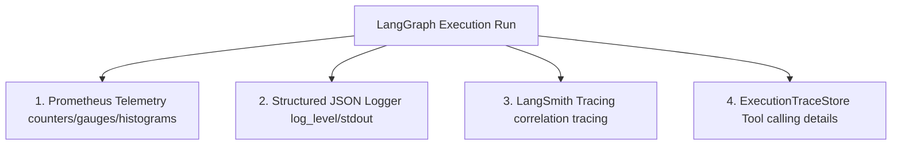
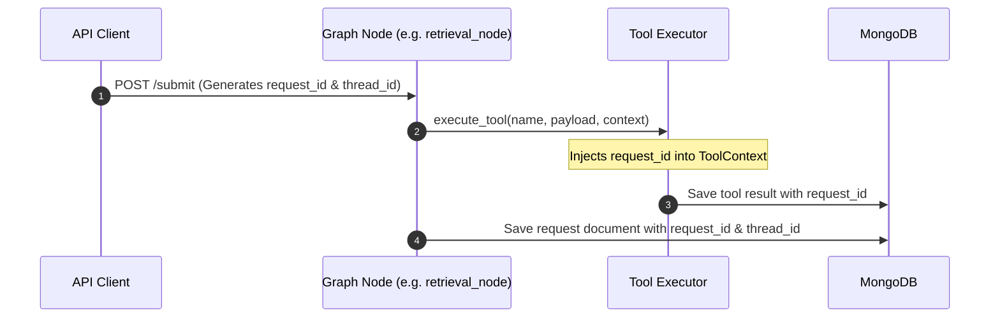

# Observability, Metrics & Telemetry Architecture

This document defines the telemetry standards, Prometheus metrics collector, structured JSON logging framework, and LangSmith tracing integrations of the RTI Agent multi agent system.

## Observability Framework Overview

The system is equipped with a complete, production grade telemetry framework:



These observability tiers ensure that system operations are transparent, trackable, and easy to debug in production.

### Tracing Frameworks
* **LangSmith**: Used to trace the LangGraph multi agent execution flow (node transitions, LLM reasoning, inputs/outputs).
* **OpenTelemetry (`opentelemetry-sdk`)**: Used to capture distributed traces and performance metrics across FastAPI routes and background tasks, providing an end to end view of the HTTP request lifecycle.

## Prometheus Instrumentation Specification

The system exposes operational metrics via standard Prometheus collectors:

### Latency Metrics
* **`rti_agent_duration`** (Histogram): Tracks the execution time of each graph node, enabling precise latency profiling and bottleneck detection.

### Retrieval Telemetry
* **`faiss_search_duration`** (Histogram): Measures raw FAISS index query latency.
* **`rti_retrieval_score`** (Histogram): Observes similarity scores for incoming queries, indicating knowledge base alignment.

### Classification Metrics
* **`rti_classification_confidence`** (Counter): Monitors the confidence distribution of target department classifications.

### Quality Control
* **`rti_hallucination_flags_total`** (Counter): Tracks the volume of hallucination issues flagged by the reviewer node.

### Loop Tracking
* **`rti_retry_total`** (Counter): Tracks self correction loop counts across nodes.

### HITL Decisions
* **`rti_approval_decisions`** (Counter): Monitors human reviewer validation rates.

## Correlation Request Tracing

To trace a user query as it flows through the multi agent graph, external tools, database inserts, and background tasks, the system implements a **correlation tracing strategy**:



1. **Request Tracking**: Every new submission generates a unique `request_id` (UUID) and `thread_id` that are populated in the starting state.
2. **Context Propagation**: When a node invokes a tool, the `ToolExecutor` wraps the call in a `ToolContext`, injecting the `request_id` into the tool's execution thread.
3. **Audit Trail**: This correlation token is written to every JSON log entry and database insert, allowing developers to trace the complete end to end execution.

## Structured JSON Logging

The system rejects traditional text streams in favor of structured JSON logging (`python-json-logger`). This output is easily parsed by central logging tools (e.g., Elasticsearch, Datadog). 

### PII Log Redaction
Crucially, before any log is written to stdout or a file, the `pii_redactor.py` module scrubs sensitive data to ensure that PII is never leaked into the logging infrastructure.

```json
{
  "timestamp": "2026-05-20T16:08:12.345Z",
  "level": "INFO",
  "logger": "graph.nodes.retrieval_node",
  "message": "[RetrievalNode] done | request_id=8f2b3c7a-92e1 | chunks=5 | cache_hit=false | confidence=0.884 | latency_ms=452",
  "request_id": "8f2b3c7a-92e1-4c3e-8b1a-85d72b21c432",
  "thread_id": "thread_8372"
}
```

## LangSmith Integration

When enabled (`LANGCHAIN_TRACING_V2=true`), the LangChain orchestrator automatically sends execution traces to the central LangSmith dashboard. This records nested tool invocations, prompt variations, output schemas, and API raw tokens, facilitating deep, visual debugging of agent chains.
