# Interactive System Map & Directory Guide

This document acts as a visual navigation map and directory portal for the RTI-Agent multi-agent documentation suite. It organizes the 25 manuals into conceptual pillars, establishing cross-linked pathways so engineers and administrators can easily navigate the ecosystem.

---

## 1. Documentation Conceptual Pillars

The documentation is organized into five core architectural portals. You can click on any document link to navigate directly to its technical manual:

### Central Navigation Entrance
* 🗣️ **[Plain-English System Guide](file:///C:/Users/akash/RTI_Agents/docs/SYSTEM_PLAIN_ENGLISH_GUIDE.md)** — A comprehensive, non-technical manual explaining the entire workflow, agent responsibilities, drafts, RAG searches, and notifications.

### Pillar 1: Orchestration & Node Manuals (The Agents)
* 🗺️ [Master Agent System Overview](file:///C:/Users/akash/RTI_Agents/docs/agents/AGENT_SYSTEM_OVERVIEW.md) — The 15-node graph topology and orchestration paradigm.
* 🚪 [Router Agent Manual](file:///C:/Users/akash/RTI_Agents/docs/agents/router_agent.md) — Normalization, language detection, and input security checks.
* 📋 [Planner Agent Manual](file:///C:/Users/akash/RTI_Agents/docs/agents/planner_agent.md) — Custom execution paths and tool discovery planner.
* ✍️ [Formatter Agent Manual](file:///C:/Users/akash/RTI_Agents/docs/agents/formatter_agent.md) — Legal draft structuring under Section 6(1) of the RTI Act.
* 🏢 [Classifier Agent Manual](file:///C:/Users/akash/RTI_Agents/docs/agents/classifier_agent.md) — Department mapping directory and Gemini fallbacks.
* 🔍 [Retrieval Agent Manual](file:///C:/Users/akash/RTI_Agents/docs/agents/retrieval_agent.md) — Multilingual hybrid vector store retrieval and citations.
* ⚖️ [Reviewer Agent Manual](file:///C:/Users/akash/RTI_Agents/docs/agents/reviewer_agent.md) — Senior review gate, grounding evaluation, and hallucination checks.
* 🔄 [Reflection Agent Manual](file:///C:/Users/akash/RTI_Agents/docs/agents/reflection_agent.md) — Autonomous self-correction, retries, and query amending.
* 🛑 [Approval Agent (HITL) Manual](file:///C:/Users/akash/RTI_Agents/docs/agents/approval_agent.md) — LangGraph checkpointer interrupts, MongoDB awaits, and resumes.
* 📬 [Tracker Agent Manual](file:///C:/Users/akash/RTI_Agents/docs/agents/tracker_agent.md) — Unique Tracking ID assignments, MongoDB persistence, and SMTP alerts.

### Pillar 2: Core Platform Architecture
* 🔄 [LangGraph Execution Flow](file:///C:/Users/akash/RTI_Agents/docs/architecture/LANGGRAPH_EXECUTION_FLOW.md) — StateGraph node bindings, conditional routing, and compilation.
* 💾 [State Dictionary Schema](file:///C:/Users/akash/RTI_Agents/docs/state/STATE_ARCHITECTURE.md) — Mutual vs. immutable properties, state lifecycle, and node transitions.
* 🧠 [Memory Architecture](file:///C:/Users/akash/RTI_Agents/docs/memory/MEMORY_ARCHITECTURE.md) — Episodic FAISS stores, semantic Redis caching, and duplicate suppression.
* 🛠️ [MCP Tool Calling Registry](file:///C:/Users/akash/RTI_Agents/docs/tools/TOOL_CALLING_ARCHITECTURE.md) — Sandbox permissions, execution safety, and parallel async gather.
* 🗂️ [RAG Retrieval Flow](file:///C:/Users/akash/RTI_Agents/docs/architecture/RAG_RETRIEVAL_FLOW.md) — PDF/HTML loading, scanned text OCR cleanups, and distance metrics.

### Pillar 3: Governance, Security & Telemetry
* ⚖️ [Human-in-the-Loop Governance](file:///C:/Users/akash/RTI_Agents/docs/governance/HITL_GOVERNANCE_FLOW.md) — Risk escalation thresholds, audit trails, and manual override workflows.
* 🛡️ [Security & Sanitization](file:///C:/Users/akash/RTI_Agents/docs/architecture/SECURITY_ARCHITECTURE.md) — PII redactors, prompt injection filters, and rate limiting policies.
* 📊 [Observability & Monitoring](file:///C:/Users/akash/RTI_Agents/docs/observability/OBSERVABILITY_ARCHITECTURE.md) — Structured JSON logging, Prometheus metrics telemetry, and dashboards.
* 🗃️ [Resource & Resource Inventory](file:///C:/Users/akash/RTI_Agents/docs/architecture/SYSTEM_INVENTORY.md) — Central matrix registry of nodes, 26 tools, databases, and metrics.

### Pillar 4: Workflow Execution Traces (Walkthroughs)
* 🟢 [Standard Submission Flow](file:///C:/Users/akash/RTI_Agents/docs/workflows/new_rti_submission_flow.md) — Complete walkthrough trace of a new, standard RTI application request.
* 🌐 [Multilingual Query Flow](file:///C:/Users/akash/RTI_Agents/docs/workflows/multilingual_query_flow.md) — Process trace of Hinglish/Devanagari mixed inputs and localized results.
* 🔴 [Hallucination Recovery Flow](file:///C:/Users/akash/RTI_Agents/docs/workflows/hallucination_recovery_flow.md) — Quality review failure, reflection query rewriting, and self-correction.
* 🟡 [HITL Pause & Resume Flow](file:///C:/Users/akash/RTI_Agents/docs/workflows/approval_resume_flow.md) — LangGraph interrupts, MongoDB awaiting snapshots, SMTP alerts, and API resumption.
* 🔵 [Retrieval Diagnostics & Debug Flow](file:///C:/Users/akash/RTI_Agents/docs/workflows/retrieval_debug_flow.md) — RAG Redis cache miss, FAISS Euclidean lookup, reranking, and SQLite logging.

---

## 2. Interactive System Map Diagram

```mermaid
graph TD
    classDef doc fill:#ececff,stroke:#9370db,stroke-width:1px;
    classDef workflow fill:#dcfce7,stroke:#16a34a,stroke-width:1px;
    classDef index fill:#fef9c3,stroke:#ca8a04,stroke-width:2px;

    INDEX[docs/README.md]:::index --> SYSTEM_MAP[docs/SYSTEM_MAP.md]:::index
    SYSTEM_MAP --> AGENTS[Pillar 1: Agent Manuals]
    SYSTEM_MAP --> CORE[Pillar 2: Core Platform]
    SYSTEM_MAP --> GOV[Pillar 3: Governance & Security]
    SYSTEM_MAP --> WALKTHROUGHS[Pillar 4: Workflows & Traces]

    %% Agent Mapping
    AGENTS --> OVERVIEW[AGENT_SYSTEM_OVERVIEW.md]:::doc
    OVERVIEW --> router[router_agent.md]:::doc
    OVERVIEW --> planner[planner_agent.md]:::doc
    OVERVIEW --> formatter[formatter_agent.md]:::doc
    OVERVIEW --> classifier[classifier_agent.md]:::doc
    OVERVIEW --> retrieval[retrieval_agent.md]:::doc
    OVERVIEW --> reviewer[reviewer_agent.md]:::doc
    OVERVIEW --> reflection[reflection_agent.md]:::doc
    OVERVIEW --> approval[approval_agent.md]:::doc
    OVERVIEW --> tracker[tracker_agent.md]:::doc

    %% Core Platform Mapping
    CORE --> graph_flow[LANGGRAPH_EXECUTION_FLOW.md]:::doc
    CORE --> state[STATE_ARCHITECTURE.md]:::doc
    CORE --> memory[MEMORY_ARCHITECTURE.md]:::doc
    CORE --> tools[TOOL_CALLING_ARCHITECTURE.md]:::doc
    CORE --> rag[RAG_RETRIEVAL_FLOW.md]:::doc

    %% Governance & Telemetry Mapping
    GOV --> hitl[HITL_GOVERNANCE_FLOW.md]:::doc
    GOV --> security[SECURITY_ARCHITECTURE.md]:::doc
    GOV --> observability[OBSERVABILITY_ARCHITECTURE.md]:::doc
    GOV --> inventory[SYSTEM_INVENTORY.md]:::doc

    %% Walkthroughs Mapping
    WALKTHROUGHS --> trace_std[new_rti_submission_flow.md]:::workflow
    WALKTHROUGHS --> trace_multi[multilingual_query_flow.md]:::workflow
    WALKTHROUGHS --> trace_halluc[hallucination_recovery_flow.md]:::workflow
    WALKTHROUGHS --> trace_pause[approval_resume_flow.md]:::workflow
    WALKTHROUGHS --> trace_debug[retrieval_debug_flow.md]:::workflow
```

