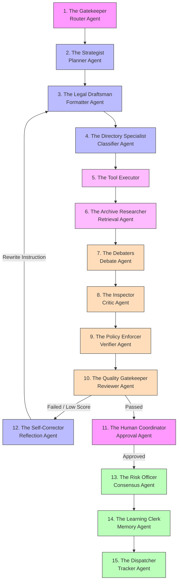

# The RTI-Agent: A Plain-English Guide to How Your RTI Application is Processed

Imagine you walk into a specialized government consulting firm to file a **Right to Information (RTI) application**. You don't know the exact legal formats, you aren't sure which specific department handles your request, and you don't know which municipal rules apply. 

Instead of making you do the research, this firm has **15 highly trained officers** (which we call **AI Agents**) sitting in a single conference room. They share a central whiteboard to coordinate, collaborate, and peer-review your application until it is absolutely perfect, grounded in real municipal facts, legally bulletproof, and ready to be filed.

This guide explains in plain English—without technical jargon—exactly how these officers take your simple query and turn it into a registered, tracked, and verified RTI submission.

---

## 🚪 Meet the 15 Specialized Officers (The Agents)

To understand the workflow, let's first meet the team members sitting around the conference table:



### The Drafting & Strategy Team
1. **The Gatekeeper (Router Node)**: Sits at the front door. Welcomes you, cleans up spelling mistakes, normalizes your text, translates mixed languages (like Hinglish), and determines what you need.
2. **The Strategist (Planner Node)**: Draws up a step-by-step master plan of what resources, databases, and tools the team will need to answer your request.
3. **The Legal Draftsman (Formatter Node)**: Takes your informal questions and drafts a formal, legally structured application that matches Section 6(1) of the RTI Act.
4. **The Directory Specialist (Classifier Node)**: Maps your query to the exact government department (like the Pimpri Chinchwad Municipal Corporation) that legally holds the records you want.

### The Research & Verification Team
5. **The Tool Executor (Tool Selection Node)**: A swift assistant who triggers and runs external lookups and searches simultaneously.
6. **The Archive Researcher (Retrieval Node)**: Searches the firm's vast digital archives of government guidelines, budgets, and circulars to find facts related to your request.
7. **The Debaters (Debate Node)**: A panel of three internal specialists (the Defender, Critic, and Verifier) who argue with each other to double-check that research results are accurate and don't contradict each other.
8. **The Inspector (Critic Node)**: Looks for weak spots in the department mappings or low scores in the archive research.
9. **The Policy Enforcer (Verifier Node)**: Confirms that all cited documents, laws, and budget numbers are valid and match current municipal guidelines.

### The Quality Gate & Final Persistence Team
10. **The Quality Gatekeeper (Reviewer Node)**: A senior reviewer who evaluates the completed draft for tone, legal accuracy, completeness, and highlights any "hallucinations" (fictional facts or policies made up by the writer).
11. **The Human Coordinator (Approval Node)**: Pauses the team's work, saves the draft safely, and dispatches an email to you (the human) to get your approval before finalizing.
12. **The Self-Corrector (Reflection Node)**: If the senior reviewer rejects the draft, this officer analyzes the errors, rewrites the instruction set, and tells the Draftsman how to fix it on the next try.
13. **The Risk Officer (Consensus Node)**: Aggregates all quality scores, review feedback, and research confidence indexes into a single safety percentage score.
14. **The Learning Clerk (Memory Learning Node)**: Takes notes on how the request was handled so the firm can work faster and smarter on similar queries in the future.
15. **The Dispatcher (Tracker Node)**: Generates your unique tracking ID, saves the completed application to the main database, dispatches the final email alert to you, and triggers the formal dispatch.

---

## 🔄 The Complete Step-by-Step Journey of Your Query

Here is the exact journey your query takes from the moment you submit it to the moment you receive your completed, tracked document.

### Phase 1: Submission & Understanding (Steps 1–4)
*   **Step 1: Submission**: You submit a simple, informal request in mixed language, for example: *"PCMC road repair budget details chahiye ward 14 ka."*
*   **Step 2: Gatekeeping & Cleaning**: The **Gatekeeper** immediately goes to work. It cleans the text, detects that it is written in **Hinglish** (Hindi written in Roman letters), and identifies that you want to file a **new request**. It standardizes the input so the rest of the team receives a clean, normalized string.
*   **Step 3: Strategic Planning**: The **Strategist** reviews your request and writes a plan: *"We must search for Pune's municipal road budgets, lookup active ward directors, and use the hybrid search tool."*
*   **Step 4: Legal Drafting**: The **Legal Draftsman** translates the intent and drafts a formal, structured application. It structures it with official legal headings, references to Section 6(1) of the RTI Act, 2005, and frames your questions politely and specifically.

> [!NOTE]
> **How Your Application is Formatted**: 
> Instead of a chat response like *"Here is the budget details..."*, the Formatter turns your query into a structured legal template:
> ```
> To,
> The Public Information Officer (PIO),
> [Target Department Address]
> 
> Subject: Application under Section 6(1) of the Right to Information Act, 2005.
> 
> 1. Full Name of Applicant: Akash
> 2. Address: ...
> 3. Particulars of Information Required:
>    (i) Please provide the approved budget ledger allocation details for road repairs in Ward 14 during fiscal year 2024.
>    (ii) ...
> ```

---

### Phase 2: Location & Fact-Checking (Steps 5–9)
*   **Step 5: Mapping the Government Directory**: The **Directory Specialist** maps your request. It determines that the target department is the **Pimpri Chinchwad Municipal Corporation (PCMC)** and assigns it a high confidence rating.
*   **Step 6: Researching the Archives (RAG)**: The **Archive Researcher** queries the digital library. It retrieves two documents: an English PDF of the `PCMC Road Works Budget 2024` and a Marathi circular regarding ward funding.
*   **Step 7: Distance-to-Trust Conversion**: To make sure these documents are actually relevant, the researcher translates the mathematical search distance into a simple **Trust Score** between `0` and `100%`.
*   **Step 8: Reranking & Deduplication**: The researcher sorts through the documents, throws out duplicate pages, and boosts the scores of documents that perfectly match the department (PCMC) or are very recent, keeping only the best top-5 facts.
*   **Step 9: Peer-Review & Debate**: Before writing the final facts down, the **Debaters** double-check the search outputs. The Critic and Policy Enforcer make sure that the cited sections match municipal guidelines and contain no contradictions.

---

### Phase 3: The Quality Gate & Self-Correction (Steps 10–12)

```
[ Formatter Node ] ──(Draft RTI)──> [ Reviewer Node ]
       ▲                                  │
       │                                  ▼
(Rewrite Query) ◄── [ Reflection Node ] ◄─(FAIL: Hallucinated policy name)
```

*   **Step 10: Senior Quality Inspection**: The draft goes to the **Quality Gatekeeper**. It grades the legal tone, grounding (no made-up facts), and specificity.
*   **Step 11: Detecting Hallucinations**: If the Draftsman accidentally made up a policy name (like the *"Pune Smart City Road Resurfacing Scheme 2024"* which doesn't exist in the archives), the Quality Gatekeeper flags it, marks the review as **Failed**, and records specific feedback.
*   **Step 12: Autonomous Self-Correction**: 
    *   Since the review failed, the **Self-Corrector** takes over. It increments the retry counter to `1`.
    *   It analyzes the mistake and rewrites the instruction: *"Rewrite the draft. Omit the specific Smart City 2024 scheme, and instead request standard road works budget rules."*
    *   It loops back to the **Legal Draftsman**, who regenerates a clean, grounded application. The Quality Gatekeeper reviews it again and marks it **Passed (96% score)**!

---

### Phase 4: Human Approval, Persistence & Dispatch (Steps 13–15)
*   **Step 13: Human-in-the-Loop Interrupt**: 
    *   Because sending applications to the government requires human oversight, the **Human Coordinator** halts execution.
    *   It saves a pending snapshot of the draft in the main database (**MongoDB**) and freezes the exact state of the conference room in a transaction log database (**SQLite**).
    *   It dispatches a clean, interactive **email notification** to you.
*   **Step 14: Resuming with Human Approval**:
    *   You receive the email, review the drafted RTI application on your dashboard, make a minor edit (like typing your specific street name), and click **"Approve"**.
    *   The system receives your POST request, retrieves the frozen graph from the SQLite checkpointer, applies your inline edits, and **resumes** execution seamlessly.
*   **Step 15: Final Dispatch & Tracking**:
    *   The **Risk Officer** calculates the final confidence index (`95%`).
    *   The **Learning Clerk** registers the successful workflow template in the firm's long-term memory.
    *   The **Dispatcher** generates your unique Tracking ID (e.g. `RTI-202605-A9D4E2`), saves the final submitted document to MongoDB, triggers an email alert confirming successful submittal, and updates your user dashboard.

---

## 🤝 How the Officers Communicate: The Shared Board

In traditional multi-agent systems, agents play "telephone." Agent A sends a chat message to Agent B, Agent B processes it and sends it to Agent C. This often leads to confusion, missing details, and lost contexts.

The RTI-Agent firm uses a **Stateful Shared whiteboard** paradigm:

```
        ┌──────────────────────────────────────────────┐
        │                 WHITEBOARD                   │
        │                                              │
        │  * raw_query: "PCMC road repair..."          │
        │  * formal_query: "To: PIO, PCMC..."          │
        │  * department: "Pimpri Chinchwad..."         │
        │  * retrieved_context: ["PCMC Budget..."]     │
        │  * status: "awaiting_approval"               │
        └──────────────────────────────────────────────┘
            ▲                ▲                ▲
            │                │                │
     [Router Node]    [Formatter Node] [Reviewer Node]
```

*   There is a large **whiteboard** in the center of the conference room (which we call the `RTIAgentState` dictionary).
*   Instead of passing messages, every officer reads the current values written on the whiteboard.
*   When an officer completes their task, they walk up to the whiteboard and update only the fields they are responsible for (e.g., the Directory Specialist updates the `department` field).
*   Central graph routing rules decide which officer should step up to the whiteboard next.
*   This ensures that **100% of the context** is preserved throughout the entire workflow, completely eliminating telephone-game errors.

---

## 📈 Subsystem Summary: In Plain English

| Conceptual Step | Who is working? | What does it do in plain English? | How it helps you? |
| :--- | :--- | :--- | :--- |
| **1. Input Sanitization** | The Gatekeeper | Cleans up typing mistakes and translates regional mixed slang. | You can write queries informally in Hinglish or Marathi and the system will understand it. |
| **2. Legal Framing** | The Legal Draftsman | Turns informal questions into a structured, formal Section 6(1) petition. | Guarantees your petition complies with statutory government standards. |
| **3. Department Lookup** | The Directory Specialist | Finds the correct municipality or department address. | You don't have to waste time researching who holds the records. |
| **4. Fact Grounding** | The Archive Researcher | Searches local municipal budget archives to find matching facts. | Prevents your request from being rejected for requesting impossible or nonexistent records. |
| **5. Quality Gating** | The Senior Reviewer | Audits the draft for completeness, tone, and made-up facts. | Ensures only highly precise, grounded drafts are compiled. |
| **6. Human Barrier** | The Human Coordinator | Freezes execution and sends you a review email. | Keeps you in complete control to review, edit, and approve before submittal. |
| **7. Final Registration** | The Dispatcher | Assigns a tracking ID, saves everything, and updates your dashboard. | Provides a secure audit trail to track the status of your application. |
