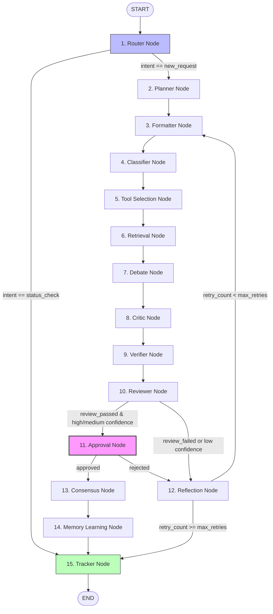
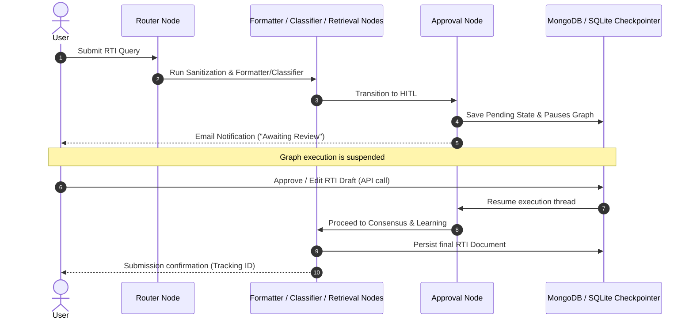

# Agent System Overview: RTI-Agent Multi-Agent Ecosystem

This document provides a comprehensive system architecture overview of the RTI-Agent multi-agent ecosystem. It defines the core graph design, orchestration models, routing patterns, and operational loops that enable enterprise-grade processing of Right to Information (RTI) applications.

---

## 1. Core Architecture & Graph Topology

RTI-Agent is orchestrated as a stateful, multi-agent network powered by **LangGraph**. The system models the process of drafting, validating, reviewing, and persistence of RTI applications as a series of specialized nodes executing on a shared context dictionary, `RTIAgentState`.

The graph utilizes **15 logical agent nodes**, structured with a mix of linear stages, conditional branches, and self-correcting cyclic loops.

### Graph Topology Diagram

---

## 2. Agent Inventory & Responsibilities

| # | Node Name | Agent Role / Responsibility | Key Technology / LLM |
|---|---|---|---|
| **1** | `router_node` | Entry gatekeeper. Performs input normalization, language detection, transliteration, prompt injection scrubbing, and intent classification. | Llama 3.1 8B (Groq) |
| **2** | `planner_node` | Evaluates the query to create a customized execution path, selecting RAG tools based on intent and required permissions. | PlanningAgent Engine |
| **3** | `formatter_node` | Translates queries to English if needed, drafting structured, legally formal RTI applications matching Indian government guidelines. | Llama 3.3 70B (Groq) |
| **4** | `classifier_node` | Maps the query to the correct target government department. | Gemini 1.5 Pro (Fallback: Llama 70B) |
| **5** | `tool_selection_node` | Discovers and executes relevant external tools in parallel according to permitted scope boundaries. | Parallel Tool Executor |
| **6** | `retrieval_node` | Fetches domain-specific context from the multilingual hybrid vector store. | Hybrid RAG Retriever |
| **7** | `debate_node` | Resolves inconsistencies in tool results through multi-agent debate (Defender, Critic, Verifier). | DebateManager |
| **8** | `critic_node` | Identifies low-confidence department classifications, low RAG similarity scores, or citation gaps. | Rules Engine / Critic LLM |
| **9** | `verifier_node` | Confirms the validity of citations and enforces department-specific policies and compliance. | Policy Enforcer |
| **10** | `reviewer_node` | Evaluates complete draft applications for grounding, legal tone, specificity, and hallucination flags. | Gemini 1.5 Pro |
| **11** | `approval_node` | Human-in-the-Loop interrupt node. Pauses execution, persists pending status, and handles post-resume. | LangGraph checkpointer / MongoDB |
| **12** | `reflection_node` | Analyzes negative reviews/rejections, rewriting prompt instructions for autonomous self-correction. | Llama 3.3 70B (Groq) |
| **13** | `consensus_node` | Aggregates reviews, retrieval scores, grounding checks, and debate outputs into a final risk and confidence score. | Rules Engine |
| **14** | `memory_learning_node` | Extracts learnings from successful workflows to update episodic memory and tool-usage statistics. | FAISS / MongoDB |
| **15** | `tracker_node` | Assigns tracking IDs, persists completed submissions to MongoDB, sends email alerts, and compiles final outputs. | SMTP / MongoDB |

---

## 3. Orchestration & Collaboration Paradigm

### Shared-State Orchestration
RTI-Agent rejects the classical "chatty" autonomous agent loop in favor of a **Stateful Graph Orchestration** paradigm. Rather than agents passing ad-hoc messages to each other:
1. Every agent behaves as a functional node that reads from the immutable and mutable fields of a central state (`RTIAgentState`).
2. Agents return state differentials (deltas) that LangGraph patches into the shared state.
3. Node transition decisions are centralized in the graph routers (`graph/router.py`), preventing complex distributed state bugs.

### Collaboration Models
The ecosystem utilizes two key collaboration forms:
* **Linear Division of Labor**: The `PlannerNode`, `FormatterNode`, and `ClassifierNode` perform sequential structural drafting.
* **Adversarial Debating**: The `DebateNode` and `CriticNode` play an adversarial role. The `DebateNode` coordinates a multi-agent debate to double-check search results, while the `CriticNode` flags classification weaknesses before passing the draft to the senior `ReviewerNode`.

---

## 4. Operational Lifecycles

### Self-Reflection & Retry Loop
If the `ReviewerNode` fails the drafted application (due to poor grounding or legal quality) or if the `ClassifierNode` has low confidence:
1. The graph routes to `ReflectionNode`.
2. The `ReflectionNode` reads the user's intent, the draft, and the reviewer's feedback, identifying exactly what went wrong.
3. It constructs an `amended_query` containing correction instructions, increments `retry_count`, and routes back to `FormatterNode`.
4. This cycle repeats until `retry_count == max_retries` (default: 2), at which point it bypasses reflection to prevent infinite loops and routes to the user.

### Human-in-the-Loop (HITL) Lifecycle
Governance is enforced via a physical execution barrier:
1. The graph is compiled with `interrupt_before=["approval_node"]`.
2. Upon reaching `approval_node` on a fresh request, the node saves the draft and current metrics to MongoDB, triggers an email alert to the applicant, and **suspends execution**.
3. The graph state is preserved in SQLite checkpointers via the unique `thread_id`.
4. When a human reviews the draft via the API, they submit an approval or rejection, optionally providing inline edits (`edited_query`).
5. The API writes the decision to the checkpointer and calls `.resume()`, waking the graph up to continue through `ConsensusNode` (if approved) or `ReflectionNode` (if rejected).

---

## 5. System Interconnections & Tracing

### Traceability and Observability
Every stage of execution is tracked:
* **Audit Trails**: The exact execution sequence is written to `workflow_path` in the state.
* **Latency Instrumentation**: `agent_durations` records the millisecond performance of each node.
* **Model Logging**: `llm_models_used` tracks which LLM executed at each step (e.g. `llama-3.1-8b-instant`, `llama-3.3-70b-versatile`, or `gemini-1.5-pro`).
* **Tool Tracing**: All tool results, including circuit breaker and retry counts, are written to `tool_results` and mirrored in the `ExecutionTraceStore`.

---

## 6. Code Mapping

* **Graph Compiler**: [graph/graph_builder.py](file:///C:/Users/akash/RTI_Agents/graph/graph_builder.py)
* **Conditional Edges**: [graph/router.py](file:///C:/Users/akash/RTI_Agents/graph/router.py)
* **Master State Schema**: [graph/state.py](file:///C:/Users/akash/RTI_Agents/graph/state.py)
