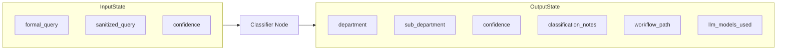
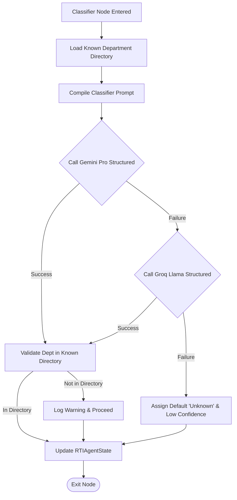

# Classifier Agent Manual: Department Classifier & Router

The **Classifier Agent** (implemented as `classifier_node`) is the administrative director of the multi-agent system. It identifies the target government department responsible for answering the information requested in the drafted RTI application.

---

## 1. Why this Agent Exists

### Problem Solved
Under Section 6(1) of the RTI Act, 2005, an application must be addressed to the correct Public Authority. If an application is submitted to the wrong department, the government department may delay, lose, or ultimately reject the application (although Section 6(3) requires transfer, this often introduces severe administrative delays of over 30 days).
Classifying the correct department is difficult because:
1. User queries are often cross-departmental (e.g., street light issues involve both Public Works and Municipal Corporations).
2. The agent must match requests against a specific list of valid public entities rather than fabricating generic department names.

### Failure Impact
Without the Classifier Agent:
* RTI applications would be addressed to nonexistent or irrelevant government bodies.
* Downstream RAG retrievers would query the wrong vector indexes, bringing back garbage policy documents.
* The workflow would fail to select appropriate department-specific tools.

---

## 2. Agent Metadata

* **Real Code File**: [graph/nodes/classifier_node.py](file:///C:/Users/akash/RTI_Agents/graph/nodes/classifier_node.py)
* **Primary Model**: `gemini-1.5-pro` (via Google AI Studio, chosen for deep reasoning and schema alignment)
* **Fallback Model**: `llama-3.3-70b-versatile` (via Groq API, triggered if Google APIs rate limit or fail)
* **Key Tasks Hooks**:
  * Primary: `task="classification"`
  * Fallback: `task="classification_fallback"`

---

## 3. Operational State Boundaries



### Input State Fields
* `formal_query` (str): Legal RTI draft generated by Formatter Agent.
* `sanitized_query` (str): Security scrubbed query as fallback.

### Output State Fields
* `department` (str): The predicted target government department.
* `sub_department` (str): The predicted sub-branch or office.
* `confidence` (str): Confidence score: `"high"`, `"medium"`, or `"low"`.
* `classification_notes` (str): Model's explanation for classification matching.
* `workflow_path` (list[str]): Appended with `"classifier_node"`.
* `llm_models_used` (dict): Updates showing which model resolved classification (`"gemini-1.5-pro"` or `"llama-3.3-70b-versatile"`).

---

## 4. Internal Logic Workflow



### 1. Known Department Resolution
Loads the list of legally valid public authorities via `get_valid_departments()`. This directory maps to registered agencies (e.g. Ministry of Finance, Ministry of Health, Municipal Corporation).
* *Code Reference*: [tools/department_lookup.py](file:///C:/Users/akash/RTI_Agents/tools/department_lookup.py)

### 2. Structured Pydantic Invocation
The agent compiles a prompt containing the drafted RTI application text and the valid departments directory list. It uses native structured outputs with Pydantic schema validation:
```python
class ClassificationOutput(BaseModel):
    department: str
    sub_department: str = ""
    confidence: str          # "high" | "medium" | "low"
    notes: str = ""
```
This ensures the LLM's response matches exactly the target schema, preventing JSON parsing errors.

### 3. Fallback Resilience Architecture
If the Gemini API encounters a quota limit, transient network failure, or API outage, the agent catches the error, logs a warning, and fires a structured payload to the fallback Groq model (`llama-3.3-70b-versatile`). If both APIs fail, the agent defaults to `"Unknown Department"` with a `"low"` confidence classification, allowing downstream human reviewers to re-route.

---

## 5. Security & Trust Scores

* **Trust Scoring Input**: The classification `confidence` score (`"high"`, `"medium"`, or `"low"`) directly feeds the **Consensus Aggregator** (`consensus_node.py`).
* **Loop Control**: A classification confidence of `"low"` combined with poor review scores will trigger the `ReflectionNode` self-correction loop, instructing the Formatter to re-draft with higher specificity.

---

## 6. Observability & Downstream Consumers

### Emitted Metrics
* `rti_agent_duration`: Labels: `agent="classifier_node"`. Logs processing latency.
* `rti_classification_confidence`: Labels: `confidence=confidence`. Increments counts of `"high"`, `"medium"`, and `"low"` confidence decisions to trace model drifting.

### Downstream Consumers
* **Downstream Node**: `tool_selection_node`. The tool selection node uses the target department string to fetch department-specific compliance policies, directories, and search tools.
