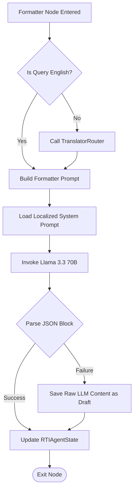

# Formatter Agent Manual: Legal Structurer & Draft Generator

The **Formatter Agent** (implemented as `formatter_node`) is the core legal compiler of the multi-agent system. It converts informal, raw user queries into structured, formal, and polite Right to Information (RTI) application drafts conforming to Indian legal requirements.

---

## 1. Why this Agent Exists

### Problem Solved
Citizens filing RTI queries frequently write in informal, conversational, or unstructured language. They might submit vague queries like *"My street has potholes, fix it"* or ask questions in a localized language using phonetic scripts.
RTI applications are formal legal documents that must be sent to Public Information Officers (PIOs). They must:
1. Reference specific sections of the Right to Information Act, 2005.
2. Formulate clear, itemized requests for physical documents, records, or logs (rather than asking conversational "why" questions).
3. Contain essential applicant identification and local residency details.

### Failure Impact
Without the Formatter Agent, raw user queries would be rejected by PIOs due to lack of specificity, informal tone, or structural invalidity. The entire downstream RAG validation and departmental classification would also fail due to unstructured context.

---

## 2. Agent Metadata

* **Real Code File**: [graph/nodes/formatter_node.py](file:///C:/Users/akash/RTI_Agents/graph/nodes/formatter_node.py)
* **Underlying Model**: `llama-3.3-70b-versatile` (Groq API, selected for high legal reasoning capacity and instruction compliance)
* **Primary Task Hook**: `task="formatting"`

---

## 3. Operational State Boundaries

```mermaid
graph LR
    InputState([RTIAgentState Inputs]) --> Formatter[Formatter Node]
    Formatter --> OutputState([RTIAgentState Outputs])
    
    subgraph InputState
        sanitized_query[sanitized_query]
        raw_query[raw_query]
        detected_language[detected_language]
        response_language[response_language]
        user_input[user_input]
    end
    
    subgraph OutputState
        translated_query[translated_query]
        formal_query[formal_query]
        rti_template[rti_template]
        workflow_path[workflow_path]
        tools_used[tools_used]
    end
```



### Input State Fields
* `sanitized_query` (str): Security-scrubbed query from the router.
* `raw_query` (str): Fallback query if sanitization failed.
* `detected_language` (str): Query language code (e.g. `"mr"`, `"hi"`).
* `response_language` (str): Target output language.
* `user_input` (dict): Applicant profile information containing:
  * `name`: Applicant name
  * `address`: Mailing address
  * `state`: State of residence
  * `district`: District

### Output State Fields
* `translated_query` (str): The English translation of the query used for RAG searching.
* `formal_query` (str): The drafted formal RTI text returned by the model.
* `rti_template` (dict): Key-value extraction fields generated in JSON (e.g., name, address, specific details).
* `workflow_path` (list[str]): Appended with `"formatter_node"`.
* `tools_used` (list[str]): Appended with `"translate_tool"` if translation occurred.

---

## 4. Internal Logic Workflow



### 1. English Normalization
If `detected_language` is not `"en"`, the Formatter Agent executes:
```python
translated = await TranslatorRouter().translate(query, target_language="en", source_language=language)
```
This guarantees that the internal reasoning, matching, and vector search operations run on standardized English terminology.
* *Code Reference*: [multilingual/translation/translator_router.py](file:///C:/Users/akash/RTI_Agents/multilingual/translation/translator_router.py)

### 2. Prompt Compilation & Localization
The agent compiles a prompt combining:
* The user's query and their geographical/administrative context (State, District).
* Standard RTI template structures (e.g., requesting certified copies of records, inspections of files, and referencing Section 6(1) of the RTI Act).
* A localized language prompt instruction retrieved via:
  ```python
  MultilingualPromptRouter().get("formatter", response_language)
  ```
  This instructs the Llama model to write the final drafted text in the applicant's target language (e.g., Hindi, Marathi, Kannada) while retaining standard legal English references.
* *Code Reference*: [prompts/formatter.py](file:///C:/Users/akash/RTI_Agents/prompts/formatter.py)
* *Code Reference*: [multilingual/prompts/multilingual_prompt_router.py](file:///C:/Users/akash/RTI_Agents/multilingual/prompts/multilingual_prompt_router.py)

### 3. Structured Parsing & Fallbacks
The system prompt instructs Llama to return a strict JSON envelope:
```json
{
  "formal_query": "The fully drafted RTI application letter...",
  "rti_template": {
    "applicant_name": "...",
    "subject": "...",
    "specific_information_sought": ["..."]
  }
}
```
If the raw output contains markdown code blocks or invalid characters, the agent cleanses the string. If parsing still fails (throws `JSONDecodeError`), the agent implements a fail-safe fallback: it stores the entire LLM response text directly inside `formal_query`, ensuring no drafted content is lost.

---

## 5. Security & Robustness

* **Sanitization Boundary**: The formatter consumes `sanitized_query` generated by the Router Agent, ensuring no injection vectors reach the larger 70B model.
* **Error Resilience**: If the translation API fails, the node catches the exception, logs a warning, and drafts the RTI application directly from the non-translated raw query.

---

## 6. Observability & Downstream Consumers

### Emitted Metrics
* `rti_agent_duration`: Labels: `agent="formatter_node"`. Observes processing time in seconds.

### Downstream Consumers
* **Downstream Node**: `classifier_node`. The classifier consumes the structured `formal_query` drafted by the Formatter to predict the target government department with high precision.
