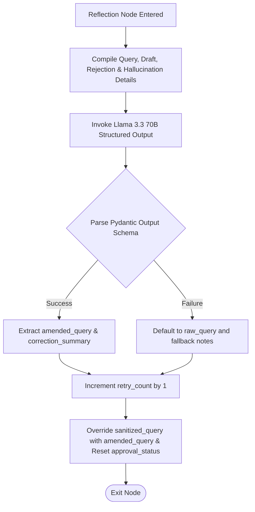

# Reflection Agent Manual: Autonomous Self-Correction Loop

The **Reflection Agent** (implemented as `reflection_node`) is the self-healing mechanism of the multi-agent system. When a drafted RTI application fails the quality gate or is rejected by a human reviewer, this agent analyzes the failure feedback, reformulates the instructions, and routes the workflow back to the formatter for correction.

---

## 1. Why this Agent Exists

### Problem Solved
If an agentic system lacks a feedback loop, a drafting error or classification mismatch results in a permanent failure. Without correction:
1. LLM errors like hallucinations or missing facts would go uncorrected.
2. A human rejection (e.g. *"Please ask for information from 2022 instead of 2023"*) would require the user to restart the entire submission process from scratch.
3. The system could not autonomously refine its legal arguments when confronted with policy compliance violations.

### Failure Impact
Without the Reflection Agent:
* The system would have a single-pass architecture. Any drafting error would require manual correction by the user, defeating the value of the autonomous drafting assistant.
* The system would be prone to infinite loops if not managed by structured retry counters.

---

## 2. Agent Metadata

* **Real Code File**: [graph/nodes/reflection_node.py](file:///C:/Users/akash/RTI_Agents/graph/nodes/reflection_node.py)
* **Underlying Model**: `llama-3.3-70b-versatile` (Groq API, selected for structured analysis and logical rewriting)
* **Primary Task Hook**: `task="reflection"`

---

## 3. Operational State Boundaries

```mermaid
graph LR
    InputState([RTIAgentState Inputs]) --> Reflection[Reflection Node]
    Reflection --> OutputState([RTIAgentState Outputs])
    
    subgraph InputState
        raw_query[raw_query]
        formal_query[formal_query]
        review_feedback[review_feedback]
        hallucination_flags[hallucination_flags]
        approval_status[approval_status]
        retry_count[retry_count]
        max_retries[max_retries]
    end
    
    subgraph OutputState
        reflection_needed[reflection_needed]
        reflection_reason[reflection_reason]
        retry_count_out[retry_count]
        sanitized_query[sanitized_query]
        approval_status_out[approval_status]
        workflow_path[workflow_path]
    end
```



### Input State Fields
* `raw_query` (str): Original user query input.
* `formal_query` (str): Drafted RTI application that was rejected.
* `review_feedback` (str): Explanatory feedback from Reviewer or Human.
* `hallucination_flags` (list[str]): Bullet list of hallucinated terms.
* `approval_status` (str): Rejection indicator if rejected by a human.
* `retry_count` (int): Number of retries already attempted.
* `max_retries` (int): Permitted retry threshold (default: `2`).

### Output State Fields
* `reflection_needed` (bool): Indicator if re-drafting is warranted.
* `reflection_reason` (str): Explanation of errors and needed corrections.
* `retry_count` (int): Incremented counter.
* `sanitized_query` (str): **Amended query instructions** passed to the Formatter.
* `approval_status` (str): Reset back to `"pending"`.
* `workflow_path` (list[str]): Appended with `"reflection_node:retry_{count}"`.

---

## 4. Internal Logic Workflow



### 1. Rejection Reason Diagnostics
The agent combines automated review scores and human actions into a single `rejection_reason`:
```python
rejection_reason = (
    f"HUMAN REJECTED: {approval_status}"
    if approval_status == "rejected"
    else f"REVIEW FAILED: {review_feedback}"
)
```

### 2. Structured Reformulation Prompt
Using Pydantic validation, the agent forces the LLM to output a precise correction schema:
```python
class ReflectionOutput(BaseModel):
    reflection_needed: bool
    amended_query: str
    correction_summary: str
    specific_additions: list[str] = []
    tone_corrections: list[str] = []
```
The model evaluates the original query, the failed draft, and the feedback, formulating a corrected instruction set (the `amended_query`). For example, if a draft failed due to missing applicant contact details or incorrect state laws, the model writes:
*"Redraft the Maharashtra municipal road inspection RTI application, ensuring you cite Section 6(1) of the Maharashtra RTI Rules 2005 and explicitly add the applicant's resident address..."*

### 3. Override Strategy
To trigger the loop without adding complex nodes to the graph, the Reflection Agent **overwrites** the `sanitized_query` with the newly generated `amended_query`. When the graph loops back, the `FormatterNode` reads this amended text as its primary drafting instruction. It also resets `approval_status` to `"pending"` to ensure the new draft is reviewed and approved.

---

## 5. Loop Termination & Downstream Consumers

### Preventing Infinite Loops
The system implements a strict retry cap. The next routing node is determined dynamically by the conditional router `route_after_reflection(state)`:
```python
def route_after_reflection(state: RTIAgentState) -> str:
    if reflection_needed and retry_count < max_retries:
        return "formatter_node"
    return "tracker_node"
```
If the system has already hit `max_retries` (default: 2), it halts further loops and routes straight to `tracker_node` to persist the state and alert the user, avoiding compute waste and infinite loops.
* *Code Reference*: `route_after_reflection(state)` inside [graph/router.py](file:///C:/Users/akash/RTI_Agents/graph/router.py#L39-L46)

---

## 6. Observability & Downstream Consumers

### Emitted Metrics
* `rti_retry_total`: Labels: `agent="reflection_node"`. Increments the global system retry counter.
* `rti_agent_duration`: Labels: `agent="reflection_node"`. Logs processing latency.
