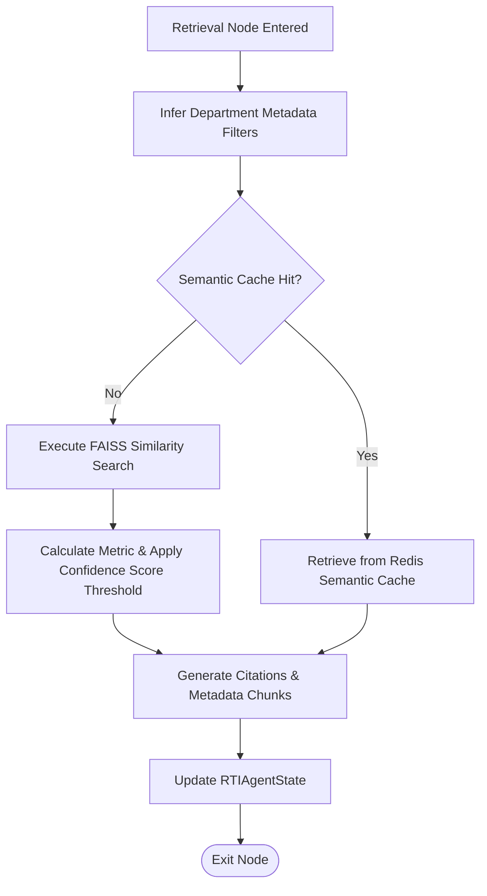

# Retrieval Agent Manual: Multilingual Hybrid RAG Engine

The **Retrieval Agent** (implemented as `retrieval_node`) is the empirical grounding center of the multi-agent system. It queries a high-performance vector store and hybrid index to fetch the exact legal guidelines, government circulars, fee rules, and administrative policies matching the target department and query.

---

## 1. Why this Agent Exists

### Problem Solved
RTI applications must ask for information that a department actually maintains. Furthermore, rules governing RTI submissions vary drastically across Indian states and central departments (e.g. Maharashtra requires a specific court fee stamp layout, while Central departments accept Indian Postal Orders).
To draft a grounded RTI application and verify that it complies with regulations, the system cannot rely on static LLM weights (which suffer from hallucinations and knowledge cutoff). It must perform **Retrieval-Augmented Generation (RAG)** to fetch real-world government guidelines, directory details, and circular policies.

### Failure Impact
Without the Retrieval Agent:
* The Formatter would draft applications with generic, obsolete, or incorrect legal citations.
* The system would struggle to verify compliance with departmental fee regulations, leading to applications being rejected due to payment errors.
* The `ReviewerNode` would have no grounded source of truth to evaluate if the draft is accurate, resulting in undetected hallucinations.

---

## 2. Agent Metadata

* **Real Code File**: [graph/nodes/retrieval_node.py](file:///C:/Users/akash/RTI_Agents/graph/nodes/retrieval_node.py)
* **Core RAG Controller**: [rag/retriever.py](file:///C:/Users/akash/RTI_Agents/rag/retriever.py)
* **Vector Store**: `RealFaissStore` (in `rag/vectorstore/faiss_store.py`)
* **Vector DB Engine**: FAISS (Facebook AI Similarity Search)

---

## 3. Operational State Boundaries

```mermaid
graph LR
    InputState([RTIAgentState Inputs]) --> Retrieval[Retrieval Node]
    Retrieval --> OutputState([RTIAgentState Outputs])
    
    subgraph InputState
        formal_query[formal_query]
        sanitized_query[sanitized_query]
        raw_query[raw_query]
        department_in[department]
        detected_language[detected_language]
        response_language[response_language]
    end
    
    subgraph OutputState
        retrieved_context[retrieved_context]
        retrieval_scores[retrieval_scores]
        retrieval_sources[retrieval_sources]
        retrieval_citations[retrieval_citations]
        retrieval_metadata[retrieval_metadata]
        retrieval_confidence[retrieval_confidence]
        cache_hit[cache_hit]
        tools_used[tools_used]
    end
```



### Input State Fields
* `formal_query` (str): Legal RTI draft generated by Formatter Agent.
* `sanitized_query` (str): Fallback query string.
* `department` (str): Predicted government department from Classifier.
* `detected_language` / `response_language` (str): Query and output language codes.

### Output State Fields
* `retrieved_context` (list[str]): Top-k text chunks retrieved from documents.
* `retrieval_scores` (list[float]): Cosine similarity scores converted to 0.0 - 1.0 confidence bands.
* `retrieval_sources` (list[str]): Metadata source URL/file paths.
* `retrieval_citations` (list[str]): Human-readable citations (e.g. `"RTI Rules: page 12"`).
* `retrieval_metadata` (list[dict]): Full document chunks metadata dictionaries.
* `retrieval_confidence` (float): Aggregate retrieval confidence rating.
* `cache_hit` (bool): Indicator if semantic cache was hit.
* `workflow_path` (list[str]): Appended with `"retrieval_node"`.

---

## 4. Internal Logic Workflow



### 1. Department Filter Inference
The agent runs `infer_department(formal_query, state.get("department"))` to determine the target metadata query boundary. If the classifier classified the department as general but the query mentions specific municipal terms, it refines the filter.
* *Code Reference*: [rag/retrievers/metadata_filter.py](file:///C:/Users/akash/RTI_Agents/rag/retrievers/metadata_filter.py)

### 2. Hybrid Retrieval Execution
The agent invokes the primary RAG controller:
```python
payload = await retrieve_multilingual_results(
    formal_query,
    department=department,
    k=top_k,
    response_language=response_language
)
```
This controller performs:
* A lookup in the **Semantic Cache** (Redis) to check if a similar query was processed recently.
* A similarity search over the FAISS store using Google Gemini Embeddings (`text-embedding-004`).
* Metadata filtering on the department, document type, and language fields.

### 3. Score Conversion & Citation Generation
The FAISS search yields L2 distance scores, which the agent converts into similarity scores between `0.0` and `1.0` via:
```python
def _distance_to_similarity(distance: float) -> float:
    return max(0.0, min(1.0, 1.0 / (1.0 + max(distance, 0.0))))
```
For each chunk, the agent builds a human-readable citation (e.g., `"{title}: {source_path}, page {page_number}"`) to ensure transparency.

---

## 5. Security & Trust Scores

* **Trust Scoring Input**: The `retrieval_confidence` rating represents the average similarity score of the top retrieved chunks. If this score is below a strict threshold (default `0.55`), the `CriticNode` and `ConsensusNode` will mark the workflow as high-risk, requesting manual approval or forcing a re-draft.
* **Metadata Guardrails**: Metadata fields are checked against trusted paths to prevent external document injections.

---

## 6. Observability & Downstream Consumers

### Emitted Metrics
* `faiss_search_duration`: Tracks vector search query times in seconds.
* `rti_retrieval_score`: Observes similarity scores for incoming queries.
* `rti_agent_duration`: Labels: `agent="retrieval_node"`. Logs processing latency.

### Downstream Consumers
* **Downstream Node**: `debate_node`. The debate agent consumes the retrieved context and citation records to conduct structured debate verification of the extracted legal assertions.
