# Reviewer Agent Manual: Senior Quality Reviewer & Hallucination Detector

The **Reviewer Agent** (implemented as `reviewer_node`) acts as the senior quality gatekeeper for the RTI-Agent multi-agent workflow. It evaluates drafted RTI applications against retrieved policy contexts and the user's initial intent, grading them on completeness, legal alignment, and factual grounding.

---

## 1. Why this Agent Exists

### Problem Solved
Large Language Models (LLMs) can exhibit behavioral quirks when drafting complex documents:
1. **Hallucination**: Fabricating legal rules, sections of the RTI Act, or reference numbers that do not exist.
2. **Vagueness**: Creating general, non-specific queries that Public Information Officers (PIOs) can legally reject.
3. **Impolite or Demanding Tone**: Writing in a demanding or non-standard format that does not comply with government protocols.
4. **Departmental Mismatch**: Aligning requests with the wrong public authority (e.g. asking the Ministry of Power for municipal water line records).

### Failure Impact
Without the Reviewer Agent:
* Hallucinated drafts would be submitted directly to government offices, risking public rejections, fines, or loss of credibility.
* Users would have to manually review every single application line-by-line, defeating the purpose of an autonomous agent drafting system.
* The system would have no automated way to trigger self-correction loops when drafts fall below compliance bars.

---

## 2. Agent Metadata

* **Real Code File**: [graph/nodes/reviewer_node.py](file:///C:/Users/akash/RTI_Agents/graph/nodes/reviewer_node.py)
* **Underlying Model**: `gemini-1.5-pro` (via Google AI Studio, optimized for high reasoning and long-context analysis)
* **Primary Task Hook**: `task="review"`

---

## 3. Operational State Boundaries

```mermaid
graph LR
    InputState([RTIAgentState Inputs]) --> Reviewer[Reviewer Node]
    Reviewer --> OutputState([RTIAgentState Outputs])
    
    subgraph InputState
        formal_query[formal_query]
        department_in[department]
        confidence_in[confidence]
        retrieved_context[retrieved_context]
        raw_query[raw_query]
    end
    
    subgraph OutputState
        review_passed[review_passed]
        review_score[review_score]
        grounding_score[grounding_score]
        hallucination_flags[hallucination_flags]
        review_feedback[review_feedback]
        workflow_path[workflow_path]
    end
```



### Input State Fields
* `formal_query` (str): Legal RTI draft generated by Formatter Agent.
* `department` (str): Predicted target department from Classifier Agent.
* `confidence` (str): Classification confidence level.
* `retrieved_context` (list[str]): Top retrieved legal chunks from RAG.
* `raw_query` (str): Original user query input.

### Output State Fields
* `review_passed` (bool): Quality gate indicator (`True` if the draft passes all checks).
* `review_score` (float): Aggregate legal structure score (`0.0` - `1.0`).
* `grounding_score` (float): Factual grounding index against RAG documents (`0.0` - `1.0`).
* `hallucination_flags` (list[str]): List of detected hallucination issues.
* `review_feedback` (str): Actionable feedback detailing failures or confirming passes.
* `workflow_path` (list[str]): Appended with `"reviewer_node"`.

---

## 4. Internal Logic Workflow

The Reviewer Agent evaluates five key criteria:
1. **Completeness**: Does the draft specify what physical records are being requested?
2. **Legal Tone**: Is it formal, respectful, and appropriately formatted?
3. **Grounding**: Is every factual claim supported by the retrieved context?
4. **Departmental Alignment**: Does the department match the subject matter?
5. **Specificity**: Are target timelines, registers, or files clearly named?

### Structured Schema Enforcement
The agent executes via a Pydantic-validated structured output to guarantee JSON schema conformity:
```python
class ReviewOutput(BaseModel):
    review_passed: bool
    review_score: float
    grounding_score: float
    hallucination_flags: list[str] = []
    review_feedback: str
    suggested_improvements: list[str] = []
```
* *Code Reference*: [graph/nodes/reviewer_node.py](file:///C:/Users/akash/RTI_Agents/graph/nodes/reviewer_node.py#L41-L47)

### Fallback Fail-Safe
If the Gemini API encounters a transient network error or rate limit, the node catches the exception and implements a secure fail-safe fallback:
```python
review_passed = bool(formal_query and len(formal_query) > 50)
review_feedback = "Automated review failed. Manual review recommended. Error: ..."
```
This ensures the request is not dropped, routing it forward with a note recommending manual human verification.

---

## 5. Security & Trust Scores

* **Hallucination Interception**: If the model detects factual drift (e.g. fabricated fee rules or nonexistent office addresses), it populates the `hallucination_flags` list.
* **Graph Routing Logic**:
  * If the draft fails review or has low confidence, it routes to `reflection_node` for autonomous re-drafting.
  * If the draft passes review and has high/medium confidence, it routes to `approval_node` to secure human clearance.
  * *Code Reference*: `route_after_reviewer(state)` inside [graph/router.py](file:///C:/Users/akash/RTI_Agents/graph/router.py#L17-L28)

---

## 6. Observability & Downstream Consumers

### Emitted Metrics
* `rti_agent_duration`: Labels: `agent="reviewer_node"`. Records processing time.
* `rti_hallucination_flags_total`: Increments a counter based on the count of detected hallucination issues, enabling alerts on model regression.

### Downstream Consumers
* **Downstream Nodes**: Routes conditionally to `approval_node` (HITL pause) or `reflection_node` (self-correction).
