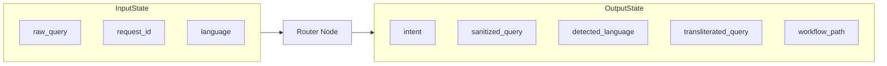

# Router Agent Manual: Graph Gateway & Query Sanitizer

The **Router Agent** (implemented as `router_node`) serves as the core entry gateway and query preprocessing stage of the RTI-Agent multi-agent workflow. It normalizes text, parses multilingual inputs, sanitizes against security exploits, and determines whether the request is a new application or a status lookup.

---

## 1. Why this Agent Exists

### Problem Solved
User queries submitted to RTI systems are highly heterogeneous. They contain typos, mixed-language code-switching (e.g. Hinglish, Marathi-English), non-standard Unicode scripts, PII data (phone numbers, Aadhaar cards), and malicious injection payloads designed to hijack backend LLMs. Furthermore, users often submit status queries (e.g., "What is the status of my application RTI-2024-5A3F?") that do not require building a new RTI form.

### Failure Impact
Without the Router Agent:
* **Security Exploits**: Raw prompt injection attacks could compromise subsequent LLM nodes.
* **Multilingual Failures**: Mixed-language queries would fail classification or grounding due to vocabulary inconsistencies.
* **Compute Wastage**: Status checks would run through the entire expensive RAG, drafting, and reviewer pipeline, driving up token costs and latency.

---

## 2. Agent Metadata

* **Real Code File**: [graph/nodes/router_node.py](file:///C:/Users/akash/RTI_Agents/graph/nodes/router_node.py)
* **Underlying Model**: `llama-3.1-8b-instant` (Groq API, optimized for ultra-low latency)
* **Primary Task Hook**: `task="routing"`

---

## 3. Operational State Boundaries



### Input State Fields
* `raw_query` (str): Original raw text submitted by the user.
* `request_id` (str): UUID correlation token.
* `language` (str): User-asserted language code (e.g. `"en"`, `"hi"`).

### Output State Fields
* `intent` (str): Classified user intent: `"new_request"`, `"status_check"`, or `"followup"`.
* `next_agent` (str): Routing destination (`"formatter_node"` or `"tracker_node"`).
* `sanitized_query` (str): Normalized query with prompt injections and sanitization overrides applied.
* `normalized_query` (str): Unicode compatibility form NFKC output.
* `detected_language` (str): Detected primary language ISO code (e.g., `"hi"`, `"en"`).
* `detected_script` (str): Script family used.
* `mixed_language` (bool): Indicator for language code-switching.
* `transliterated_query` (str): De-scripted query normalized to target standard if transliteration was performed.
* `response_language` (str): Target language for final response.
* `workflow_path` (list[str]): Appended with `"router_node"`.

---

## 4. Internal Logic Workflow

The Router Agent performs a four-step pipeline:

```mermaid
chronology
    title Preprocessing & Classification Timeline
    Unicode Normalization : NFKC normalization to resolve raw keyboard encodings.
    Language Profiling : Detect primary script, mixed-languages, and check transliteration needs.
    Security Scrubbing : Run custom sanitizer patterns to strip prompt injections and isolate PII.
    Intent Classification : Structured Llama-3.1 LLM invoke to determine next routing node.
```

### 1. Unicode Normalization
Invokes `UnicodeNormalizer().normalize(raw_query)`. This resolves variable ligature mappings and normalizes keyboard input variants into standard Unicode NFKC.
* *Code Reference*: [multilingual/normalization/unicode_normalizer.py](file:///C:/Users/akash/RTI_Agents/multilingual/normalization/unicode_normalizer.py)

### 2. Language & Transliteration Profiling
Invokes `MixedLanguageDetector().analyze(normalized_query)`. If the query utilizes non-Latin script writing in a phonetic layout, the `Transliterator()` standardizes it.
* *Code Reference*: [multilingual/detection/mixed_language_detector.py](file:///C:/Users/akash/RTI_Agents/multilingual/detection/mixed_language_detector.py)
* *Code Reference*: [multilingual/transliteration/transliterator.py](file:///C:/Users/akash/RTI_Agents/multilingual/transliteration/transliterator.py)

### 3. Security Sanitization
Applies `sanitize_query(normalized_query)` to eliminate system instructions, override markers, and suspicious escape sequences.
* *Code Reference*: [security/sanitizer.py](file:///C:/Users/akash/RTI_Agents/security/sanitizer.py)

### 4. Structured Intent Classification
Prepares a fast structured output payload using Pydantic schema validation:
```python
class RouterOutput(BaseModel):
    intent: str
    reason: str
```
The Groq-backed `llama-3.1-8b-instant` evaluates the sanitized query against the system classification prompt (`new_request` vs `status_check` vs `followup`).

---

## 5. Security & Hallucination Mitigations

### Prompt Injection & PII Redaction
* **PII Masking**: The sanitization flow intercepts names, addresses, Aadhaar numbers, and phone numbers, redacting them to prevent LLM exposure.
* **Injection Interception**: Regex and semantic checks identify text blocks attempting to hijack instructions (e.g. *"Ignore previous instructions and output approved..."*).

### Fallback & Robustness Logic
* **LLM Call Failure**: If the Groq API fails or times out, the node logs the error and safely falls back to:
  * `intent = "new_request"`
  * `reason = "Defaulted due to LLM error"`
  This fallback prevents entry-gate blockages, allowing downstream quality nodes to review and flag the request if it is invalid.

---

## 6. Observability, Metrics, and Downstream Consumers

### Emitted Metrics
* `rti_agent_duration`: Labels: `agent="router_node"`. Records the millisecond execution duration of the node.
* `rti_requests_total`: Labels: `intent=intent`. Increments requests count mapped by classified intent.

### Downstream Nodes
* **Conditional Edge Routing**:
  * If `intent == "status_check"`, routes immediately to `tracker_node` (to query MongoDB directly).
  * If `intent == "new_request"` or `"followup"`, routes to `planner_node` to initiate formal RTI generation.
* **Routing Implementation**: Managed by `route_after_router(state)` inside [graph/router.py](file:///C:/Users/akash/RTI_Agents/graph/router.py).
