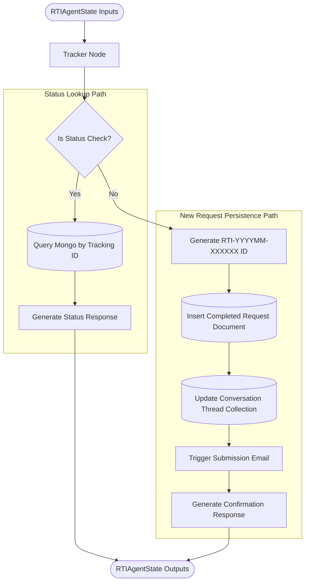

# Tracker Agent Manual: Lifecycle Tracker & Persistence Engine

The **Tracker Agent** (implemented as `tracker_node`) is the final terminal node and persistence manager of the RTI-Agent multi-agent workflow. It manages the completion lifecycle, generating unique tracking IDs, persisting records to MongoDB, triggering email notifications, and resolving application status checks.

---

## 1. Why this Agent Exists

### Problem Solved
At the end of a multi-agent drafting process, the system must transition from a transient graph execution state to a persistent database record. The final output must:
1. Be stored in an audit-compliant format containing quality scores, models used, and execution durations.
2. Be assigned a human-readable, searchable tracking reference ID.
3. Notify the applicant that their application is officially submitted.
4. Support tracking lookups so users can query the status of their application without triggering drafting flows.

### Failure Impact
Without the Tracker Agent:
* Completed RTI drafts and quality reviews would be lost upon the termination of the LangGraph runtime.
* The system would have no searchable database of active requests, preventing status lookups.
* Users would receive no submission confirmations or tracking numbers.

---

## 2. Agent Metadata

* **Real Code File**: [graph/nodes/tracker_node.py](file:///C:/Users/akash/RTI_Agents/graph/nodes/tracker_node.py)
* **Database Target**: MongoDB `rti_requests` and `conversation_threads` collections.
* **Notification Tool**: `send_submission_notification()` in [tools/notification_tool.py](file:///C:/Users/akash/RTI_Agents/tools/notification_tool.py)

---

## 3. Operational State Boundaries



### Input State Fields
* `request_id` (str): Unique request UUID.
* `intent` (str): Intent classification (`"new_request"` or `"status_check"`).
* `sanitized_query` (str): Contains query terms or the tracking ID (if checking status).
* `formal_query` (str): Final verified drafted RTI application.
* `user_input` (dict): Profiles dictionary containing applicant details (e.g., email).
* `department` (str): Predicted department classification.
* `review_score` / `grounding_score` (float): Quality assurance metrics.
* `approval_status` (str): Governance status (`"approved"` or `"rejected"`).
* `agent_durations` / `llm_models_used` (dict): Observability logs.

### Output State Fields
* `tracking_id` (str): Generated human-readable tracking ID (or retrieved ID).
* `final_response` (str): User-facing text confirming submission or status.
* `status` (str): Terminal state (e.g. `"submitted"`, `"escalated"`, `"status_returned"`, `"not_found"`).
* `active_request_id` (str): Reference to the tracking ID.
* `workflow_path` (list[str]): Appends `"tracker_node"`.

---

## 4. Internal Logic Workflow

The Tracker Agent splits execution into two separate logical pathways based on the detected intent:

### Pathway 1: Status Lookup (`intent == "status_check"`)
1. **Extraction**: Reads the tracking ID search query from the `sanitized_query` field.
2. **MongoDB Lookup**: Connects to the database and queries the `rti_requests` collection using a case-insensitive regex search:
   ```python
   doc = await mongo.db["rti_requests"].find_one(
       {"tracking_id": {"$regex": tracking_id_query, "$options": "i"}}
   )
   ```
3. **Response Compile**:
   * If found: compiles current status, department, and submission date, returning `"status_returned"`.
   * If not found: returns `"No RTI found matching..."` with a status of `"not_found"`.

### Pathway 2: New Request Submission (`intent == "new_request"`)
1. **Tracking ID Generation**: Generates a human-readable identifier using time stamps and short UUID hashes:
   * **Format**: `RTI-YYYYMM-XXXXXX` (e.g., `RTI-202605-B9F2A1`).
2. **Full Document Insert**: Compiles the final document `rti_doc` containing applicant metadata, the drafted text, quality scores, tool call summaries, model selections, and node latency logs, inserting it into `rti_requests`.
3. **Conversation Thread Update**: If `thread_id` exists, it updates the associated thread in the `conversation_threads` collection, pushing the tracking ID to its index and updating the active cursor.
4. **Email Dispatch**: Triggers `send_submission_notification()` to email the applicant their confirmation.
5. **Terminal Output**: Compiles the final success message returned to the user, setting the status to `"submitted"`.

---

## 5. Security & Governance Compliance

* **Audit Readiness**: The persisted document preserves the complete execution plan, tools called, model versions, and human approval details, enabling comprehensive operational audit logging.
* **No Code Modifications**: The tracker reads from state and database collections without altering any system runtime execution layers.

---

## 6. Observability & Downstream Consumers

### Emitted Metrics
* `rti_agent_duration`: Labels: `agent="tracker_node"`. Logs node processing latency.

### Downstream Consumers
* **Terminal Router**: Connects directly to `END`, completing the LangGraph workflow and closing the execution frame.
