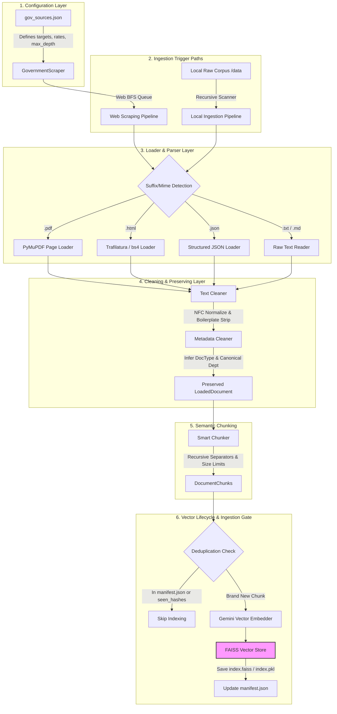

# RTI-Agent Advanced Data Pipeline Architecture
*Production-grade Config-Driven Ingestion, Multilingual Preserving Scraping, and FAISS Vector Lifecycle System*

---

## 📌 Architectural Flow Overview

The **RTI-Agent Data Pipeline** is an enterprise-grade, asynchronous, configuration-driven system designed to scrape government web portals, ingest local and remote documents (PDFs, HTML, JSON, TXT, MD), sanitize raw text, perform language-preserving script classification, and build a deduplicated semantic index using **FAISS** vector storage.

Below is the complete, high-fidelity conceptual workflow of the ingestion architecture:



---

## 🛠️ Pipeline Layers & Component Breakdown

### 1. Configuration Layer
* **Source Configuration File**: **[gov_sources.json](file:///C:/Users/akash/RTI_Agents/config/gov_sources.json)**
  * Defines scraper targets (e.g., `data.gov.in`, `maharashtra.gov.in`, `pune.gov.in`).
  * Specifies configurations including: `base_url`, `allowed_domains`, `start_paths`, `max_depth` (BFS depth), `rate_limit_per_second` (polite concurrency), and target `department`.

### 2. Crawling & Web Scraping Engine
* **Component**: **[gov_scraper.py](file:///C:/Users/akash/RTI_Agents/rag/ingestion/loaders/gov_scraper.py)**
  * **Asynchronous Traversal**: Uses `aiohttp` and `BeautifulSoup` inside an async loop to traverse web portals.
  * **Rate Limiting**: Built-in `AsyncRateLimiter` uses monotonic clock intervals and async locks to prevent hitting targets too fast.
  * **Politeness Control**: Downloads and respects target domain `robots.txt` rules using standard Python `RobotFileParser`.
  * **Robust Network Resiliency**: Features automatic connection retry loops with exponential backoff using `tenacity` retry wrappers.
  * **Storage Lineage**: Saves raw downloaded html and pdf assets into `rag/ingestion/corpus/raw/<domain>/<date>/` along with raw manifest JSON containing timestamp, byte size, source URL, and SHA-256 hashes.
  * **Fail-Safe Operation**: Logs and isolates scraper failures inside `rag/ingestion/corpus/failed/` while incrementing Prometheus tracking metrics.

### 3. Parsing & Loading Subsystem
* **Component**: **[loaders](file:///C:/Users/akash/RTI_Agents/rag/ingestion/loaders/)**
  * **PDF Loader ([pdf_loader.py](file:///C:/Users/akash/RTI_Agents/rag/ingestion/loaders/pdf_loader.py))**: Powered by **PyMuPDF (`fitz`)**. Extracts text synchronously page-by-page inside worker threads (`asyncio.to_thread`) to prevent blocking the event loop. Captures precise page numbers for citations.
  * **HTML Loader ([html_loader.py](file:///C:/Users/akash/RTI_Agents/rag/ingestion/loaders/html_loader.py))**: Uses **`trafilatura`** (optimal article-extraction library) with a fallback to `BeautifulSoup` to strip noise elements (`script`, `style`, `nav`, `header`, `footer`, `aside`, `form`) and extract central tables/articles.
  * **Structured/Raw Loaders**: Normalizes text reading with UTF-8 safety checks.

### 4. Text Ingestion & Preserving Cleaners
* **Component**: **[cleaners](file:///C:/Users/akash/RTI_Agents/rag/ingestion/cleaners/)**
  * **Text Cleaner ([text_cleaner.py](file:///C:/Users/akash/RTI_Agents/rag/ingestion/cleaners/text_cleaner.py))**:
    * Strips raw HTML/XML tags.
    * Performs **Unicode NFC Normalization** to standardize character representations.
    * Boilerplate Strip: Removes global noise lines based on regex (e.g., copyright warnings, cookie policy, enable JavaScript prompts) and frequency counters (strips repetitive headers found across similar documents).
    * Collapses excessive whitespace and standardizes date representations into standard `YYYY-MM-DD` format.
    * **Language & Script Detection**: Uses script range checks (Devanagari block `\u0900-\u097F` vs. ASCII) and keyword hits (`है`/`मंत्रालय` vs. `आहे`/`शासन`) to safely detect English (`en`), Hindi (`hi`), or Marathi (`mr`) without damaging transliterated terms.
  * **Metadata Alignment ([metadata_cleaner.py](file:///C:/Users/akash/RTI_Agents/rag/ingestion/cleaners/metadata_cleaner.py))**:
    * Computes standard content hash (`SHA-256`) of the parsed text, path, and URL.
    * Maps department aliases to canonical official government departments (e.g. mapping `"morth"` to `"Ministry of Road Transport and Highways"`).
    * Classifies documents into types (`rti_act`, `circular`, `scheme`, `tender`, `faq`, `budget_report`) based on keywords in title, path, and text.

### 5. Smart Semantic Chunking Layer
* **Component**: **[chunker.py](file:///C:/Users/akash/RTI_Agents/rag/ingestion/chunking/chunker.py)**
  * Instantiates `SmartChunker` using LangChain's `RecursiveCharacterTextSplitter`.
  * Utilizes prioritized separator sets (`\n\n`, `\n`, `. `, `? `, `! `, `; `, `, `, ` `, `""`) to keep paragraphs and sentences whole.
  * Discards garbage or low-signal chunks (less than 40 characters).
  * Generates a fully trackable, reproducible chunk ID (`base_hash:chunk_index:content_hash`) and copies parent metadata to keep tracing clean.

### 6. FAISS Vector Store & Ingestion Gate
* **Component**: **[faiss_store.py](file:///C:/Users/akash/RTI_Agents/rag/vectorstore/faiss_store.py)**
  * **Vector Ingestion Manager ([vector_manager.py](file:///C:/Users/akash/RTI_Agents/rag/vectorstore/vector_manager.py))**: Coordinates chunking and directs `RealFaissStore` to either incrementally update (`aadd_chunks`) or perform a fresh build (`arebuild`).
  * **Local Persistent Store**: Stores the vector database in `data/faiss_index/` using LangChain FAISS bindings (`index.faiss` and `index.pkl` docstore).
  * **Integrity Manifest**: Maintains `manifest.json` inside the index directory, storing a full record of all indexed `chunk_id` values, metadata, and hashes.
  * **Duplicate Prevention Gate**: Compares candidate chunk hashes and IDs against the manifest *before* embedding. If a chunk already exists, it bypasses the vector model completely, saving API costs and avoiding redundant vectors.
  * **Dangerous Deserialization Safeguard**: Standardizes trust checking, only allowing dangerous deserialization for indexes created locally in the workspace.
  * **Offline Embeddings Mocking**: The test runner is configured to use an offline mock model ensuring zero external API overhead and perfectly standardized 768-dimension vectors during test executions.

---

## 🚀 Execution & Command-Line Interfaces

The ingestion pipeline can be run locally or triggered programmatically via Python CLI interfaces:

### 1. File Ingestion Pipeline
To ingest a raw directory of local government circulars/PDFs:
```bash
python -m rag.ingestion.pipelines.ingest_documents data/documents/ --department "Ministry of Education" --rebuild
```

### 2. Website Crawler and Ingestion
To scrape configured government portals and index documents on the fly:
```bash
python -m rag.ingestion.pipelines.scrape_and_ingest --target "maharashtra.gov.in" --max-depth 2
```

### 3. Complete Ingestion Wrapper
To execute standard backward-compatible ingestion across standard raw cache folders:
```bash
python -m rag.ingestion.pipeline
```
