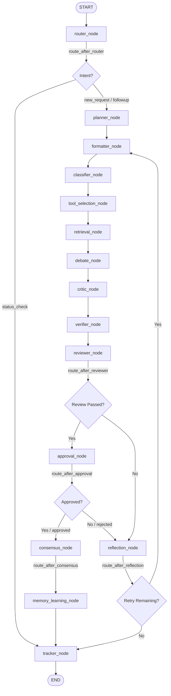
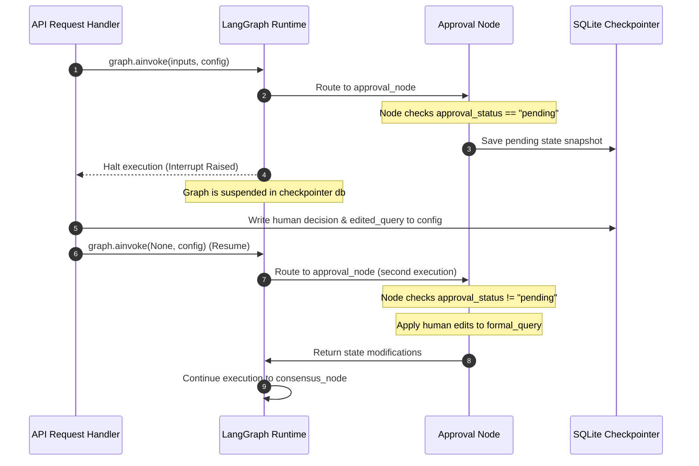
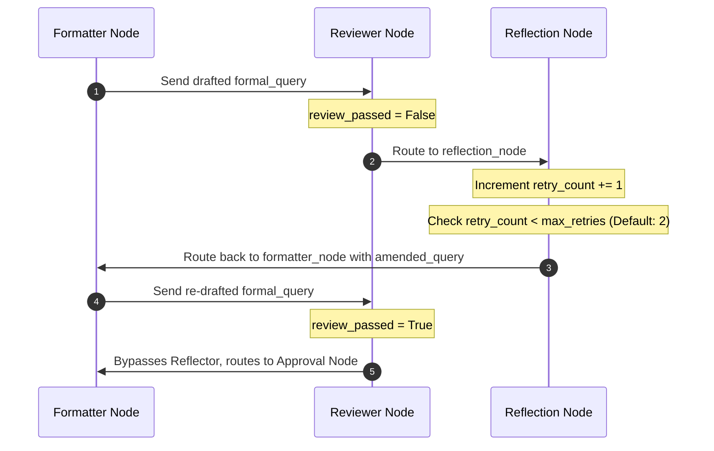

# LangGraph Execution Flow & Lifecycle Architecture

This document details the runtime execution model, node transition logic, conditional routing pathways, and state persistence boundaries of the RTI-Agent **LangGraph StateGraph** pipeline.

---

## 1. StateGraph Compilation & Node Definitions

The RTI-Agent workflow is built as an asynchronous state machine where each node acts as a functional transformer of a single shared context state (`RTIAgentState`).

* **Core Compiler**: [graph/graph_builder.py](file:///C:/Users/akash/RTI_Agents/graph/graph_builder.py)
* **Checkpointer Engine**: LangGraph SQLite checkpointer (`SqliteSaver` in SQLite `data/checkpoints/rti_checkpoints.db`)

### Node Registry Map

```python
builder = StateGraph(RTIAgentState)
for name, node in {
    "router_node": router_node,
    "planner_node": planner_node,
    "formatter_node": formatter_node,
    "classifier_node": classifier_node,
    "tool_selection_node": tool_selection_node,
    "retrieval_node": retrieval_node,
    "debate_node": debate_node,
    "critic_node": critic_node,
    "verifier_node": verifier_node,
    "reviewer_node": reviewer_node,
    "approval_node": approval_node,
    "reflection_node": reflection_node,
    "consensus_node": consensus_node,
    "memory_learning_node": memory_learning_node,
    "tracker_node": tracker_node,
}.items():
    builder.add_node(name, node)
```

---

## 2. Transition Logic & Conditional Edges

Node routing is managed via central edge-router functions rather than within individual agents. This keeps the nodes focused solely on processing text and data.



### Edge Configuration Code

* **Routing Implementations**: [graph/router.py](file:///C:/Users/akash/RTI_Agents/graph/router.py)

```python
builder.add_edge(START, "router_node")
builder.add_conditional_edges("router_node", route_after_router, {
    "planner_node": "planner_node", 
    "tracker_node": "tracker_node"
})
builder.add_edge("planner_node", "formatter_node")
builder.add_edge("formatter_node", "classifier_node")
builder.add_edge("classifier_node", "tool_selection_node")
builder.add_edge("tool_selection_node", "retrieval_node")
builder.add_edge("retrieval_node", "debate_node")
builder.add_edge("debate_node", "critic_node")
builder.add_edge("critic_node", "verifier_node")
builder.add_edge("verifier_node", "reviewer_node")
builder.add_conditional_edges("reviewer_node", route_after_reviewer, {
    "approval_node": "approval_node", 
    "reflection_node": "reflection_node"
})
builder.add_conditional_edges("approval_node", route_after_approval, {
    "consensus_node": "consensus_node", 
    "reflection_node": "reflection_node"
})
builder.add_conditional_edges("reflection_node", route_after_reflection, {
    "formatter_node": "formatter_node", 
    "tracker_node": "tracker_node"
})
builder.add_conditional_edges("consensus_node", route_after_consensus, {
    "memory_learning_node": "memory_learning_node"
})
builder.add_edge("memory_learning_node", "tracker_node")
builder.add_edge("tracker_node", END)
```

---

## 3. Human-in-the-Loop (HITL) Interrupts

The graph enforces human governance via LangGraph's native thread interruption mechanism:
```python
graph = builder.compile(
    checkpointer=checkpointer, 
    interrupt_before=["approval_node"] if enable_hitl else []
)
```

### Pause and Resume Sequence



* **Thread Preservation**: Execution threads are isolated and tracked via `thread_id` and `request_id`.
* **State Resumption**: On resumption, invoking the graph with `None` instructs the engine to hydrate the state from the SQLite checkpointer and resume immediately at the paused node (`approval_node`).

---

## 4. Cyclic Loops & Self-Correction

When a draft fails review or is rejected, the graph loops back from the `reflection_node` to the `formatter_node` to draft an improved version based on feedback.

### Retry Sequence Diagram



* **Retry Cap**: If the workflow reaches `max_retries` (default: 2) without passing review, it exits the loop to prevent infinite runs, routing directly to the `tracker_node` to persist the failure state and notify the user.

---

## 5. Async Execution & Termination Conditions

* **Asynchronous Execution**: Every agent node is declared as an `async def` function, allowing non-blocking I/O operations (such as parallel tool calling via `asyncio.gather` and asynchronous database inserts).
* **Graph Termination**: The graph terminates when:
  * A status query is resolved at `tracker_node` (routes directly to `END`).
  * A new request completes successfully and is persisted by `tracker_node` (routes directly to `END`).
  * An execution error occurs and is caught by the global error handler, writing the error to the state and routing to the tracker node for cleanup.
