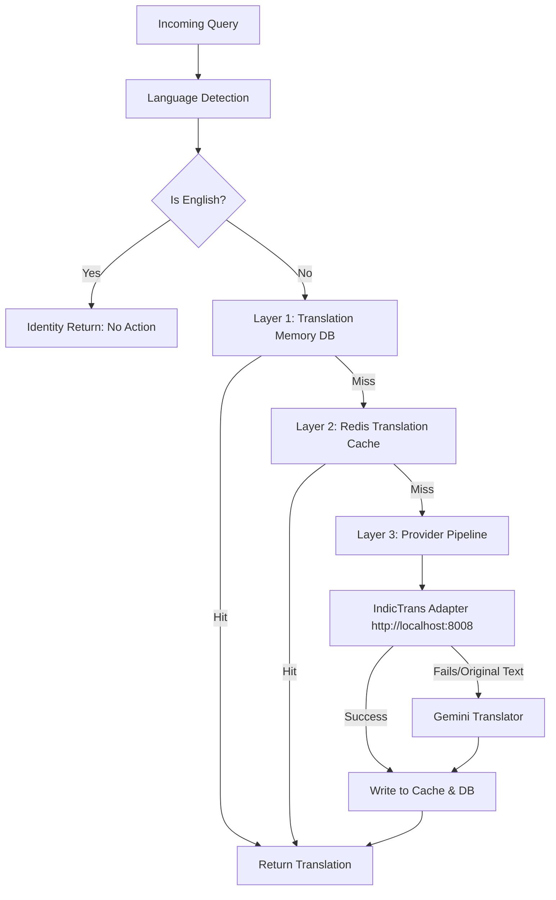

# Multilingual Translation Architecture

This document details the architecture, routing mechanics, and implementation of the multilingual translation subsystem in the RTI-Agent project.

---

## 1. Why We Translate (System Rationale)

1.  **Vector Search Standardization:** The reference legal corpus, previous templates, and government policy files are predominantly stored in English. Multi-lingual queries (e.g. Hindi, Marathi, Hinglish) would fail semantic search checks if queried raw. Translating user queries to English resolves this issue.
2.  **LLM Drafting & Reasoning Performance:** Large Language Models (LLMs) like Llama and Gemini perform complex structural drafting and legal reasoning with significantly higher fidelity in English.

---

## 2. Translation Routing Mechanics (The Cascade Pattern)

Instead of sending every query directly to an external LLM (which increases API costs and latency), the `TranslatorRouter` implements a **three-layer retrieval cascade**:

### Layer 1: Translation Memory (MongoDB)
High-confidence, previously reviewed query translations are saved in the `translation_memory` collection. If the system encounters a match, it retrieves the translation instantly, ensuring standard legal terms are translated consistently.

### Layer 2: Redis Translation Cache
For fast, in-memory lookups, the translation is stored in Redis. This reduces translation latency to under `5ms` on subsequent duplicate queries.

### Layer 3: Provider Fallback Pipeline
On a cache and memory miss, the system cycles through its translation adapters:
1.  **IndicTrans Adapter (`IndicTransAdapter`)**: Queries a local, self-hosted deployment of `ai4bharat/IndicTrans2` (hosted at `http://localhost:8008/translate`). **No external API key is required** because it interfaces with your local deployment.
2.  **Gemini Translator (`GeminiTranslator`)**: If the local IndicTrans service is offline, unresponsive, or returning the original text, the router catches the exception and falls back to using the Gemini API.

---

## 3. Detail: IndicTrans Adapter & Zero-API Key Fallback

The `IndicTransAdapter` is implemented as follows:
*   It sends an HTTP POST request to `http://localhost:8008/translate`.
*   If the local service is not running, the request throws an exception (`httpx.ConnectError` or timeout).
*   The adapter gracefully catches this exception (`except Exception: pass`) and returns the original text.
*   The router checks if the returned text is identical to the input text. If it is, the router realizes the local adapter did not translate the text, and routes the query to the `GeminiTranslator` fallback.

This allows the project to be fully functional locally without requiring a hosted IndicTrans API key.

---

## 4. Production & Configuration

Translation behaviors are controlled via environment settings:
*   `RAG_EMBEDDING_PROVIDER`: Set to `local_sentence_transformers` or `gemini`.
*   `GEMINI_API_KEY`: Required for the Gemini fallback.
