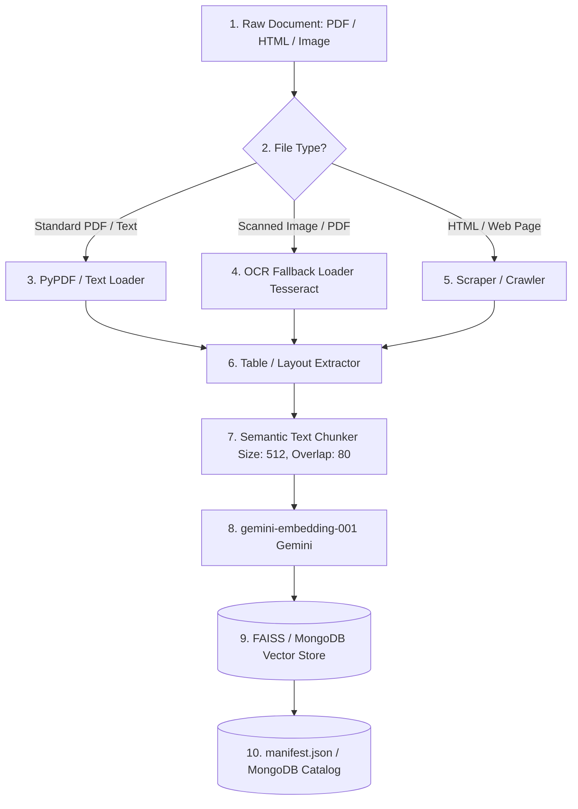
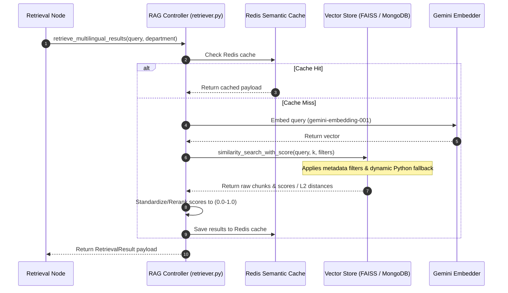

# RAG Retrieval Flow & Hybrid Vector Architecture

This document defines the ingestion pipelines, multilingual retrieval models, hybrid search logic, trust-scoring thresholds, and OCR fallbacks of the RTI-Agent RAG (Retrieval-Augmented Generation) system.

---

## 1. End-to-End Ingestion Lifecycle

To build a reliable knowledge base, policy manuals and guidelines are processed through a structured ingestion pipeline:



### 1. Scanned Document & OCR Fallback Loader
When processing administrative policy files, many documents are scanned images or low-quality PDFs containing unsearchable text.
* **OCR Fallback**: If standard text loaders return empty strings or low-density pages, the loader routes the file to the **OCR Fallback Engine** (using Tesseract OCR) to extract text from images.
* **Table Layout Extraction**: Specialized parser models extract municipal budget matrices and administrative fee tables, formatting them into Markdown tables so the embedding generator can preserve spatial data.
* *Code Reference*: [rag/ingestion/loaders/](file:///C:/Users/akash/RTI_Agents/rag/ingestion/loaders/)

### 2. Semantic Chunking & Hashing
1. Chunks are generated using a character-based semantic splitter with a `CHUNK_SIZE` of `512` and `CHUNK_OVERLAP` of `80`.
2. To prevent index duplication, the chunker computes a deterministic hash of the text:
   ```python
   def _hash(text: str) -> str:
       return hashlib.sha256(text.encode("utf-8")).hexdigest()
   ```
3. Chunks are labeled with a unique `chunk_id` format: `doc_id:index_hash` to ensure absolute tracking in the index.
* *Code Reference*: [rag/ingestion/chunking/chunker.py](file:///C:/Users/akash/RTI_Agents/rag/ingestion/chunking/chunker.py)

---

## 2. Multilingual Hybrid Retrieval Flow

When a query is processed by the `retrieval_node`, the retrieval engine executes a multi-stage search flow:



* **Multilingual Query Translation**: If the input query is non-English, the RAG controller translates it to English before performing the vector search. This aligns the search vocabulary with the English-centric policy document index. The final response is then localized back to the user's language.
* *Code Reference*: [rag/retriever.py](file:///C:/Users/akash/RTI_Agents/rag/retriever.py)

---

## 3. Trust Scoring & Reranking Guardrails

### L2 Distance to Similarity Score Conversion
The system dynamically standardizes similarity scoring based on the active vector store type:
1. **MongoDB Atlas Vector Search**: Natively calculates and returns cosine similarity scores directly in the range `0.0` to `1.0`.
2. **FAISS Vector Index**: Returns raw Euclidean L2 distance scores. To establish a normalized confidence score between `0.0` (zero similarity) and `1.0` (identical match), the local store runs:
```python
def _distance_to_similarity(distance: float) -> float:
    return max(0.0, min(1.0, 1.0 / (1.0 + max(distance, 0.0))))
```
* *Code Reference*: [rag/vectorstore/faiss_store.py](file:///C:/Users/akash/RTI_Agents/rag/vectorstore/faiss_store.py#L229-L230) and [rag/vectorstore/mongo_store.py](file:///C:/Users/akash/RTI_Agents/rag/vectorstore/mongo_store.py)

### Grounding Thresholds & Critic Flags
* **RAG Similarity Threshold**: Configured via `RAG_SIMILARITY_THRESHOLD = 0.7`. Retrieved chunks falling below this score are filtered out.
* **Low Score Escalation**: If the top retrieved chunk's similarity score is below `0.55`, the `CriticNode` flags the request (`"Low top retrieval score"`). This alerts the consensus engine to trigger human-in-the-loop validation, protecting the system against low-quality drafts.

---

## 4. Observability and Debug Replay

### Tracing and Logging
Every retrieval run writes a detailed JSON trace logging the search parameters, inferred department filters, raw scores, and generated citations to the **Retrieval Trace Logger**.
* *Code Reference*: [rag/debug/retrieval_trace_logger.py](file:///C:/Users/akash/RTI_Agents/rag/debug/retrieval_trace_logger.py)

### Deterministic Replay Debugger
Using the logged traces, developers can run replay scripts (e.g. `tests/replay/test_deterministic_replay.py`) to re-trigger search queries against exact vector indexes. This enables deterministic debugging of RAG quality, matching failures, and scoring anomalies.
