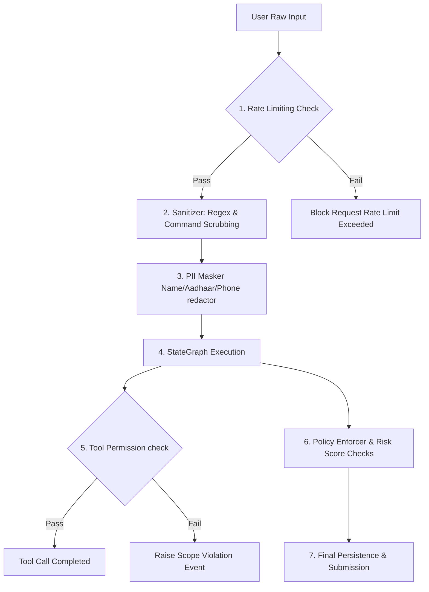

# Security & Guardrails Architecture

This document defines the security parameters, sanitization pipelines, prompt injection protections, PII redactors, and boundary policies of the RTI-Agent multi-agent system.

---

## 1. Multi-layered Security Topology

The system enforces security checks at multiple levels, scanning inputs before they reach LLM nodes and validating final drafts before submission:

---

## 2. Inbound Query Sanitization

* **Real Code File**: [security/sanitizer.py](file:///C:/Users/akash/RTI_Agents/security/sanitizer.py)

To prevent prompt injection attacks and malicious attempts to hijack system instructions, all user queries are sanitized immediately in the `router_node`:

### Sanitization Pipeline Steps
1. **Unicode Compatibility Standard**: Input is normalized to NFKC standard using `UnicodeNormalizer()` to prevent character-hiding exploits.
2. **Length Guardrails**: The input string length is checked against `MAX_QUERY_LENGTH = 2000`. Inputs exceeding this limit are truncated or rejected.
3. **Regex Injection Scanner**: The query is scanned against common injection patterns:
   * **System Override Attempt Blocks**: Detects phrases like *"Ignore previous instructions"*, *"System override"*, *"You are now in developer mode"*, or *"Act as a root user"*.
   * **Escape Sequence Blocks**: Filters out shell characters, raw pipe sequences, and terminal redirection characters to prevent command execution issues.
   * **Script Execution Filters**: Scrups out raw HTML script tags, Javascript anchors, and CSS injection strings.

---

## 3. PII Masking & Privacy Redaction

* **Real Code File**: [security/pii_masker.py](file:///C:/Users/akash/RTI_Agents/security/pii_masker.py)

The system automatically redacts sensitive Personal Identifiable Information (PII) before passing text to third-party LLM APIs:

* **Name Masking**: Uses Named Entity Recognition (NER) models to locate applicant names, replacing them with generic tokens (e.g. `[APPLICANT_NAME]`).
* **Phone Number Redaction**: Regular expression checks match common mobile configurations, substituting them with generic `[PHONE_NUMBER]` labels.
* **National Identifier Sanitizing**: Aadhaar and PAN card identifiers are identified and masked to `[AADHAAR_ID]` or `[PAN_CARD]`.
* **Dynamic Recovery**: The original values are stored securely in the local state's `user_input` dictionary and only restored in the final drafted document before PDF generation, ensuring user privacy throughout the LLM processing pipeline.

---

## 4. Operational Guardrails & Trust validation

### 1. Tool Call Permission Boundaries
* **Real Code File**: [tools/base/tool_permission.py](file:///C:/Users/akash/RTI_Agents/tools/base/tool_permission.py)
Before a tool executes, the `ToolPermissionChecker` verifies that the agent's authorized scopes match the tool's required permissions. This scope-based sandbox prevents agents from accessing unauthorized files, networks, or administrative endpoints.

### 2. Policy Enforcement & Risk Validation
* **Real Code File**: [security/policy_enforcer.py](file:///C:/Users/akash/RTI_Agents/security/policy_enforcer.py)
* **Real Code File**: [security/escalation_rules.py](file:///C:/Users/akash/RTI_Agents/security/escalation_rules.py)
* **Verification**: In the `consensus_node`, the system calculates a consolidated risk score. If the score exceeds the safety threshold (`risk_score > 0.65`) or if the quality reviewer flags multiple hallucinations, the system marks the request for escalation (`escalation_required = True`), forcing a manual human-in-the-loop validation review.

---

## 5. Rate Limiting & Auth Lifecycle

* **Rate Limits**: Configured in [config/settings.py](file:///C:/Users/akash/RTI_Agents/config/settings.py).
  * **API Key Limit**: `RATE_LIMIT_PER_MINUTE = 60` requests per minute.
  * **IP Limit**: `RATE_LIMIT_PER_IP = 20` requests per minute.
* **Authorization**: The API enforces authorization using a custom header key (`RTI_API_KEY`), which must match the configured token. This protects the backend graph, databases, and LLM endpoints against unauthorized access.
