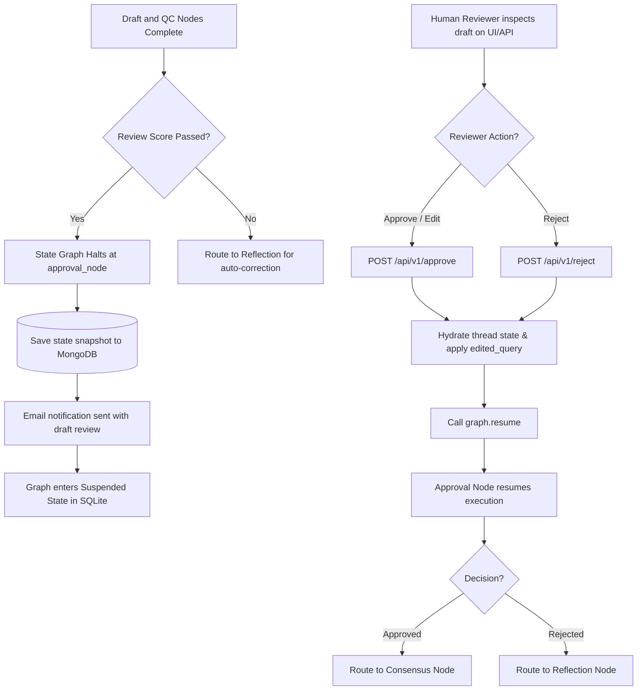

# Human-in-the-Loop (HITL) Governance & Escalation Flow

This document details the administrative safety boundaries, compliance frameworks, risk calculations, and manual intervention loops of the RTI-Agent multi-agent governance pipeline.

---

## 1. Why Governance & HITL Exist

In legal and administrative contexts, fully autonomous AI systems present several operational risks:
1. **Administrative Rejection**: Submitting an incorrect or hallucinated query to a government department can lead to immediate rejection, wasting filing fees and losing time.
2. **Regulatory Compliance**: RTI submissions must adhere strictly to municipal, state, and central legal parameters.
3. **Legal Responsibility**: The system must verify that a citizen's personal details (name, resident address) are accurate and that the information request complies with Section 6(1) of the RTI Act.

### Legal Guarantees
The system enforces a **strict physical barrier**: no application is submitted to any external government database or agency without a direct human confirmation signature (via `approval_status = "approved"`). This provides an absolute guarantee of manual verification, making the system suitable for government and enterprise compliance standards.

---

## 2. HITL Pause-Resume Lifecycle

The system compiles its StateGraph with a pause instruction:
```python
graph = builder.compile(
    checkpointer=checkpointer, 
    interrupt_before=["approval_node"] if enable_hitl else []
)
```



* **Paused Snapshot Persistence**: When the graph reaches `approval_node`, it connects to MongoDB and inserts a pending request document into the `rti_requests` collection with a status of `"awaiting_approval"`, ensuring the state is safely saved.
* **Notification System**: It dispatches an email notification containing the target department, confidence rating, review score, and draft text to the user/admin.
* **API Resumption**: The thread remains suspended in the SQLite checkpointer database until a user approves the draft via the API endpoint.

---

## 3. Risk-Based Escalation Logic

The consensus node aggregates scores across multiple processing stages to calculate the overall system risk.

* **Real Code File**: [graph/nodes/consensus_node.py](file:///C:/Users/akash/RTI_Agents/graph/nodes/consensus_node.py)
* **Real Code File**: [security/escalation_rules.py](file:///C:/Users/akash/RTI_Agents/security/escalation_rules.py)

### 1. Risk Score Formula
The system computes an overall confidence rating:
$$\text{Confidence} = (R \times 0.25) + (RC \times 0.3) + (G \times 0.2) + (DT \times 0.25)$$
Where:
* $R$: `review_score` from the quality reviewer node.
* $RC$: `retrieval_confidence` average score from the vector store.
* $G$: `grounding_score` verification index.
* $DT$: `debate_truth` scoring index from multi-agent debate.

The overall `risk_score` is then calculated as:
$$\text{Risk} = (1 - \text{Confidence}) + (\text{Citation Gap} \times 0.15) + (\text{Hallucination Count} \times 0.12)$$

### 2. Escalation Trigger Rules
The computed risk score is evaluated by the policy manager:
```python
def should_escalate(risk_score: float, hallucination_flags: list[str], approval_status: str) -> bool:
    if approval_status == "rejected":
        return True
    if risk_score > 0.65:
        return True
    if len(hallucination_flags) >= 2:
        return True
    return False
```
* **Escalation Action**: If `should_escalate` returns `True`, the system marks `escalation_required = True` and sets the recommended action to `"human_review"`. This flags the request for senior administrator review, blocking submission until the issues are resolved.

---

## 4. Governance Audit Trail

For every processed request, MongoDB stores a comprehensive audit document in the `rti_requests` collection:
* **Approved By**: The ID of the admin or user who authorized the submission.
* **Time Tracking**: `approval_timestamp` and `created_at/updated_at` time stamps.
* **Quality Metrics**: The exact quality reviews, hallucination flags, grounding scores, and risk ratings at the time of approval.
* **Tool Usage Logs**: The full list of tools called, parallel latency profiles, and model versions used.
This audit trail guarantees that every submission is fully traceable, satisfying legal and compliance standards.
