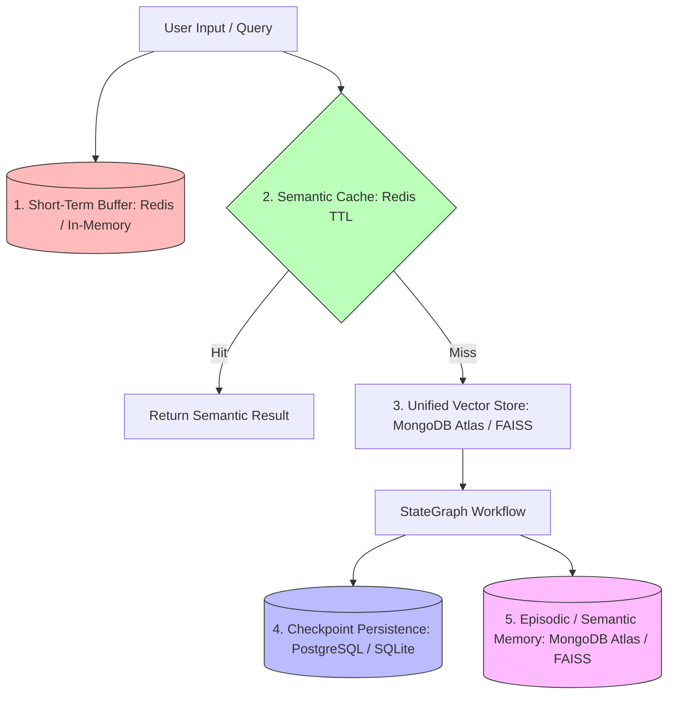
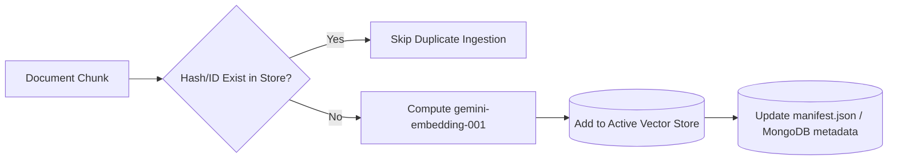

# Memory Pipeline & Storage Architecture

This document defines the multi-tiered memory pipeline of the RTI-Agent multi-agent ecosystem. It details the storage layers, caching strategies, persistent checkpointers, vector databases, and semantic learning engines that ground and persist the system's operational states.

---

## 1. Multi-Tiered Memory Hierarchy

The system orchestrates memory across five specialized layers, balancing fast in-memory lookups, semantic document indices, and audit-compliant transactional persistence:

---

## 2. Memory Tiers Specification

### 1. Short-Term Memory (Conversational Context)
* **Technology**: `ConversationBufferMemory` / Redis Session Store
* **Purpose**: Tracks active chat messages inside a conversation thread, maintaining dialog context.
* **Storage Location**: Managed dynamically by `get_conversation_memory(session_id)` and backed by Redis with a strict 30-minute Time-to-Live (`REDIS_SESSION_TTL = 1800` seconds).
* **Code Reference**: [memory/memory_manager.py](file:///C:/Users/akash/RTI_Agents/memory/memory_manager.py#L56-L59)

### 2. Semantic Cache (RAG Results Cache)
* **Technology**: Redis-backed Semantic Caching
* **Purpose**: Prevents duplicate FAISS vector searches and LLM calls for identical or highly similar queries, optimizing performance and reducing latency.
* **Storage Location**: Redis Key-Value store with a 1-hour Time-to-Live (`REDIS_SEMANTIC_CACHE_TTL = 3600` seconds).

### 3. Checkpoint Memory (Graph State Snapshots)
* **Technology**: LangGraph checkpointer system supporting SQLite (`SqliteSaver`) and Neon Serverless PostgreSQL (`LazyPostgresCheckpointer`).
* **Purpose**: Pauses and resumes workflows at human-in-the-loop boundaries and handles recovery from system crashes.
* **Storage Location**: `data/checkpoints/rti_checkpoints.db` (for SQLite local dev) or Serverless Neon Cloud PostgreSQL (for production-grade highly available pools).
* **Code Reference**: [graph/graph_builder.py](file:///C:/Users/akash/RTI_Agents/graph/graph_builder.py#L34-L38)

### 4. Semantic Memory (Historical RTI Reference Index)
* **Technology**: Unified `BaseVectorStore` resolved dynamically by `rag.vectorstore.factory.get_vector_store()`, backing either local FAISS (`RealFaissStore`) or cloud-hosted MongoDB Atlas Vector Search (`MongoDBVectorStore`).
* **Purpose**: Stores drafted RTI applications that successfully passed review, allowing future runs to retrieve similar successful drafts for reference.
* **Storage Location**: `data/vector_store/semantic_memory` (local FAISS index) or the `vector_chunks` MongoDB Atlas cloud collection.
* **Code Reference**: [memory/semantic_memory.py](file:///C:/Users/akash/RTI_Agents/memory/semantic_memory.py)

### 5. Episodic & Transactional Memory (MongoDB Long-Term Archive)
* **Technology**: MongoDB Collections (`rti_requests`, `vector_chunks`, and `conversation_threads`)
* **Purpose**: Acts as the system's long-term operational and semantic record.
* **Storage Location**: Configured dynamically via `.env` (MongoDB Atlas connection string).
* **Code Reference**: [graph/nodes/tracker_node.py](file:///C:/Users/akash/RTI_Agents/graph/nodes/tracker_node.py#L78-L127)

---

## 3. FAISS Store Lifecycle & Metadata Management

### RealFaissStore Engine
* **Real Code File**: [rag/vectorstore/faiss_store.py](file:///C:/Users/akash/RTI_Agents/rag/vectorstore/faiss_store.py)

The system utilizes `RealFaissStore` to manage vector indices on disk. Rather than relying on simple, unmonitored index files, it implements a paired storage design:
1. **`index.faiss` / `index.pkl`**: Standard FAISS vector storage file along with the pickled LangChain Document Store.
2. **`manifest.json`**: An audit-compliant JSON catalog. It maps chunk hashes, document IDs, creation timestamps, and active markers (`is_active`, `is_latest`) for every indexed item.

### Manifest Updates and Duplicate Protection
* **Duplicate Control**: During document ingestion, the store runs `skip_existing` validation, checking incoming document chunks against `manifest.json` content hashes before triggering embedding calls. This prevents index bloat and duplicate entries.
* **Supersession Handling**: When an administrative policy or rule document is updated, the system calls `deactivate_document_chunks(document_id)`. This updates the manifest to mark old chunks as inactive (`is_active: False`), dynamically excluding them from future searches without requiring an expensive index rebuild.

---

## 4. Semantic Learning & Replay

### Adaptive Learning Node
The system includes a dedicated `memory_learning_node` that runs at the end of successful drafting workflows.
1. The node extracts details from the shared state (`formal_query`, `department`, quality scores, and tool usage summaries).
2. It invokes `AdaptiveMemory().learn_from_state()` and `ToolMemory().record_workflow()`.
3. The successful draft is converted into a structured document chunk and stored in the dedicated FAISS semantic memory index via `remember_successful_request()`.
4. *Code Reference*: [graph/nodes/memory_learning_node.py](file:///C:/Users/akash/RTI_Agents/graph/nodes/memory_learning_node.py)

### Deterministic Replay Debugging
To debug RAG retrieval scoring issues or investigate hallucinations, the system records execution traces to `RetrievalTraceLogger` / `ExecutionTraceStore`. This logs the exact query, metadata filters, fetched chunks, and similarity scores. Developers can feed these logged trace payloads back into test scripts (e.g. `tests/replay/test_deterministic_replay.py`) to reproduce matching behaviors and tune retrieval settings with high precision.
