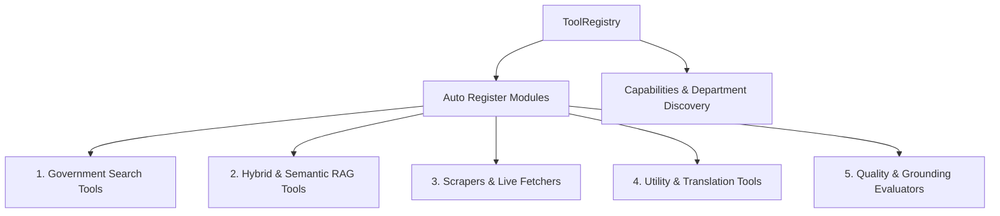
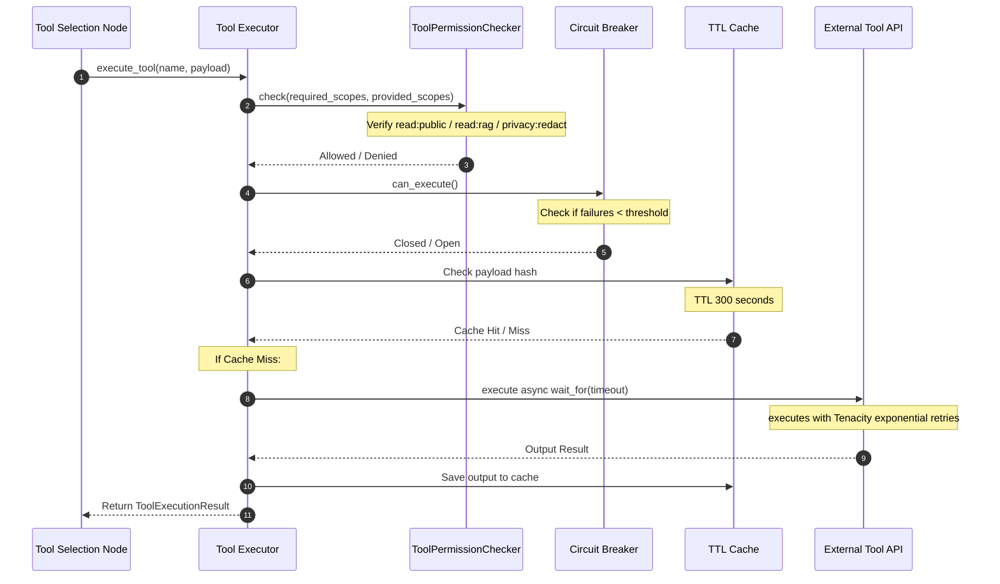

# Tool Calling & Registry Architecture

This document defines the dynamic, Model Context Protocol (MCP) inspired tool registry, parallel execution engine, rate limiters, circuit breakers, and sandbox permissions of the RTI-Agent multi-agent system.

---

## 1. Why this Architecture Exists

### Problem Solved
Autonomous agent systems frequently execute external commands, scrape websites, query databases, or call translation endpoints. Doing so without safety frameworks poses major risks:
1. **Security Vulnerabilities**: LLMs manipulating tool arguments can cause command injections or directory traversals.
2. **Cascading Failures**: A slow external government website could hang the entire agent graph.
3. **Compute Waste**: Repeating identical API searches drains resources.
4. **Credential Exposure**: Exposing full credentials to untrusted external APIs violates security best practices.

### Failure Impact
Without this Tool Calling Architecture:
* A single failing external tool would freeze the entire graph execution.
* The system would lack permission control, allowing agents to execute unauthorized tools.
* The system would lack circuit breakers, repeatedly hitting broken external APIs and triggering request limits.

---

## 2. Dynamic Tool Registry Topology

* **Real Code File**: [tools/base/tool_registry.py](file:///C:/Users/akash/RTI_Agents/tools/base/tool_registry.py)

The system manages tools via a central registration matrix:

### Registered Tools Inventory
The system auto-registers **26 production tools** categorized into logical groups:
* **Government Context**: `GovernmentSearchTool` (gov_search), `GovernmentWebsiteSearchTool` (gov_website_search), `PolicySearchTool` (policy_search), `DepartmentDirectoryTool` (department_directory), `DepartmentLookupTool` (department_lookup), `CircularLookupTool` (circular_lookup), `GazetteSearchTool` (gazette_search), `BudgetSearchTool` (budget_search), `MunicipalDataTool` (municipal_data), `RTIHistoryTool` (rti_history), `WebsiteScraperTool` (website_scraper), `SchemeLookupTool` (scheme_lookup), `RTIGuidelineTool` (rti_guideline).
* **RAG Retrieval**: `SemanticSearchTool` (semantic_search), `HybridSearchTool` (hybrid_search), `CitationTool` (citation_builder), `SummarizerTool` (summarizer).
* **Utility & Localization**: `TranslatorUtilityTool` (translator_utility), `LanguageDetectorTool` (language_detector), `PIIRedactionTool` (pii_redaction), `ValidatorTool` (validator), `FormatterUtilityTool` (formatter_utility).
* **Grounding & Analytics**: `ConfidenceTool` (confidence_scorer), `HallucinationDetectorTool` (hallucination_detector), `GroundingScoreTool` (grounding_score), `RiskAnalyzerTool` (risk_analyzer).

---

## 3. Tool Execution Lifecycle & Safeguards

All tool invocations are managed by the core executor:
* **Real Code File**: [tools/base/tool_executor.py](file:///C:/Users/akash/RTI_Agents/tools/base/tool_executor.py)

### 1. Scope-Based Sandbox Permissions
* **Permission Scopes**: Standard scopes include `read:public`, `read:rag`, `network:gov`, and `privacy:redact`.
* **Verification**: Before any execution, `ToolPermissionChecker` verifies that the agent's authorized scopes match the tool's required permissions. If authorization is missing, the executor aborts execution, returning a `permission_denied` status.
* *Code Reference*: [tools/base/tool_permission.py](file:///C:/Users/akash/RTI_Agents/tools/base/tool_permission.py)

### 2. Circuit Breaker Protection
* **Circuit Breaker**: Each tool has an isolated `CircuitBreaker` tracker.
* **Failure Tripping**: If a tool encounters 5 consecutive failures (timeouts or network errors), the circuit trips open. Subsequent calls immediately fail-fast with a `circuit_open` status, preventing the graph from blocking on broken external services.
* *Code Reference*: [tools/execution/retry_handler.py](file:///C:/Users/akash/RTI_Agents/tools/execution/retry_handler.py)

### 3. Tenacity Retries with Exponential Backoff
* **Retries**: For transient network errors, the executor wraps execution with Tenacity's `AsyncRetrying` engine.
* **Backoff Strategy**: It attempts retries up to the tool's maximum retry limit, applying an exponential backoff starting at 0.2s up to a maximum of 3s, which helps prevent overwhelming target servers.

### 4. Asynchronous Parallel Execution
* **Parallel Calling**: Inside `tool_selection_node`, tool selection is resolved dynamically. The node triggers selected tools in parallel using `asyncio.gather(*tasks)`.
* **Non-Blocking Assembly**: This parallel execution is highly efficient, assembling all search, scraped, and citation results concurrently in a single non-blocking step.
* *Code Reference*: [graph/nodes/tool_selection_node.py](file:///C:/Users/akash/RTI_Agents/graph/nodes/tool_selection_node.py#L39-L40)

---

## 4. Future Extensibility (MCP Implementation)

The registry is built using a clean interface, allowing developers to easily register new tools. To add a tool, inherit from `BaseTool`, define its input schema using Pydantic, set its categories/permissions, implement the `execute` logic, and register it inside `auto_register_tools`. The tool will automatically be discovered, secured, cached, and executed by the system.
