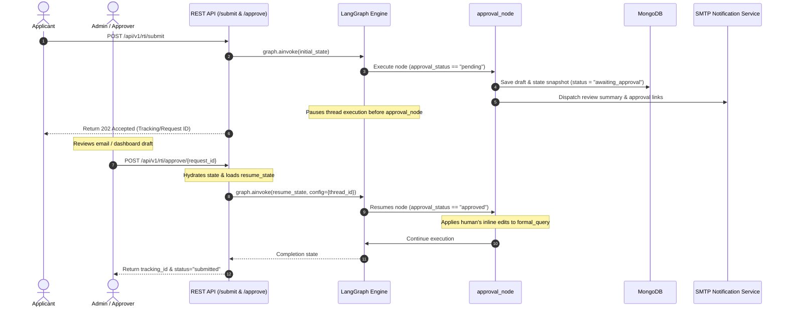

# Walkthrough: Human-in-the-Loop (HITL) Pause & Resume Flow

This document details the step-by-step lifecycle of the Human-in-the-Loop (HITL) approval mechanism. It explains how LangGraph interrupts the execution thread, how the intermediate state is saved and notified, how the REST API handles human decisions, and how the thread is hydrated and resumed to final completion.

---

## 1. Trace Scenario
* **Applicant**: Akash (Pune resident)
* **Action**: Akash submits a request via `/submit`.
* **State of the system**: The RTI draft has been generated, reviewed by `reviewer_node`, and graded with a score of `0.94`.
* **Trigger**: The graph is compiled with `interrupt_before=["approval_node"]` and `enable_hitl = true`.

---

## 2. Pause & Resume Flow Sequence Diagram



---

## 3. Step-by-Step State Evolution & Execution Trace

### Phase A: The Pause Lifecycle (First Entry)

#### 1. State Compilation & Gating
When the RTI workflow completes the `reviewer_node` with a high quality score (`review_passed == True`), the router selects `"approval_node"`.
Because the graph was compiled with:
```python
graph = builder.compile(checkpointer=checkpointer, interrupt_before=["approval_node"])
```
LangGraph halts execution *immediately before* executing the `approval_node`. However, upon the initial entry into the approval flow, the system executes the node logic with `approval_status == "pending"`.

#### 2. First-Entry State Persistence
Within `approval_node.py`, the system detects `approval_status == "pending"`. It intercepts the flow to:
* Hydrate the MongoDB client.
* Write a snapshot of the draft to the `rti_requests` collection with a status of `"awaiting_approval"`.

* **Database Schema Update (`rti_requests`)**:
  ```json
  {
    "request_id": "8a3d4f18-6c82-4118-bf12-4217fa392ef4",
    "approval_status": "pending",
    "formal_query": "To: Public Information Officer, Pune Municipal Corporation... Under Section 6(1)...",
    "department": "Pune Municipal Corporation",
    "confidence": "high",
    "review_score": 0.94,
    "status": "awaiting_approval",
    "updated_at": "2026-05-20T16:15:00Z"
  }
  ```

#### 3. SMTP Alert Dispatch
`approval_node` invokes `send_approval_notification()`. This generates an email layout detailing:
* **Review Score**: `94% Grounded & Complete`
* **Department**: Pune Municipal Corporation
* **Draft Preview**: The exact content of `formal_query`
* **Quick-Approval Links**: URL anchors pointing to the admin approval page or embedding direct action API call-backs.
* **State Evolution**:
  * Output:
    * `approval_status = "pending"`
    * `status = "awaiting_approval"`
    * `workflow_path = [..., "reviewer_node", "approval_node:pending"]`

---

### Phase B: The Resume Lifecycle (Human Action)

#### 4. The REST API Trigger
The human (or admin) reviews the draft in the dashboard or via email. The administrator chooses to approve the draft but wants to append a specific clause regarding the ward number to make it more precise.
They submit a request to the `/approve/{request_id}` endpoint.

* **API Payload (`POST /api/v1/rti/approve/8a3d4f18-6c82-4118-bf12-4217fa392ef4`)**:
  ```json
  {
    "decision": "approved",
    "approved_by": "Akash",
    "edited_query": "To: Public Information Officer, Pune Municipal Corporation... Subject: Budgets spent on road repairs in Pune municipal corporation during 2024. Please specifically include Ward 12 budget ledger accounts."
  }
  ```

#### 5. Graph Hydration & Thread Resumption
Upon receiving the payload, the REST API:
1. Locates the running graph configuration instance.
2. Extracts the `thread_id` matching the `request_id` (`"8a3d4f18-6c82-4118-bf12-4217fa392ef4"`).
3. Defines a `resume_state` payload updating only the HITL variables:
   ```python
   resume_state = {
       "approval_status": "approved",
       "approved_by": "Akash",
       "approval_timestamp": "2026-05-20T16:20:00Z",
       "edited_query": "..."
   }
   ```
4. Invokes `.ainvoke()` passing the `resume_state` and matching thread config. Under the hood, LangGraph hydrates the state from the SQLite checkpointer database (`data/checkpoints/rti_checkpoints.db`) and injects the `resume_state` values.

```python
config = {"configurable": {"thread_id": request_id}}
result = await graph.ainvoke(resume_state, config=config)
```

#### 6. Resuming approval_node Execution
The `approval_node` wakes up. Since `approval_status == "approved"`, it skips the database-save and email-dispatch blocks.
It processes the human inputs:
* Read `edited_query` from the state.
* Seeing `edited_query` is not empty, it overrides the draft: `formal_query = edited_query`.
* Emits a Prometheus count incrementing the metrics indicator: `rti_approval_decisions{decision="approved"}`.

* **State Evolution**:
  * Input State:
    * `approval_status = "approved"`
    * `edited_query = "..."`
  * Output State:
    * `formal_query = "To: Public Information Officer, Pune Municipal Corporation... Please specifically include Ward 12 budget ledger accounts."`
    * `approval_timestamp = "2026-05-20T16:20:00Z"`
    * `workflow_path = [..., "approval_node:pending", "approval_node:approved"]`

---

### Phase C: Transition to Completion

#### 7. Post-Resume Gating & Consensus routing
After the approval node completes, the conditional router `route_after_approval` is evaluated:
```python
def route_after_approval(state: RTIAgentState) -> str:
    status = state.get("approval_status")
    if status == "approved":
        return "consensus_node"
    elif status == "rejected":
        return "reflection_node"
    return "reflection_node"
```
Since `approval_status == "approved"`, the graph routes to `consensus_node`, which compiles the final risk matrix, learns from episodic traces, and executes `tracker_node` to save the finalized record to MongoDB and return the official RTI Tracking ID (`tracking_id = "RTI-202605-B9D4E2"`).

---

## 4. Key Security & Resilience Controls
1. **Thread Partitioning**: The SQLite checkpointer isolates thread states using UUIDs. The API ensures that a user can only approve a thread they own, preventing cross-tenant hijackings.
2. **Deterministic Resumption**: If the system crashes during the paused state, the checkpointer database retains the frozen execution pointer. On server restart, calling `ainvoke` with the same `thread_id` seamlessly resumes exactly where it stopped.
3. **Inline Audit Logging**: The tracking fields (`approved_by`, `approval_timestamp`, `edited_query`) provide a thorough governance log, keeping records of every amendment made by the user before submittal.
