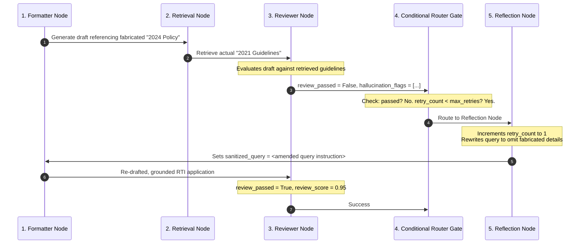

# Walkthrough: Hallucination Detection & Recovery Flow

This document details the autonomous self-correction loop designed to detect, flag, and recover from hallucinated information or ungrounded assertions in RTI drafts. It tracks the step-by-step state changes as a query fails the Quality Gate at `reviewer_node`, routes into `reflection_node`, executes query rewriting, and loops back to draft a high-fidelity, grounded RTI application.

---

## 1. Trace Scenario
* **User Input**: *"I want to know the rules for the 2024 Pune Smart City Tree Preservation Subsidy Policy and how much funds were distributed."*
* **Real Context**: The municipal corporation has a standard "Urban Tree Plantation & Protection Guideline 2021" but there is *no* official "Pune Smart City Tree Preservation Subsidy Policy 2024".
* **Initial Generation Error**: The draft generator (`formatter_node`), eager to answer, fabricates clauses of the nonexistent "Smart City Tree Preservation Subsidy Policy 2024", citing fabricated budget heads.
* **Max Retries Configuration**: `max_retries = 2`, `retry_count = 0`

---

## 2. Hallucination Recovery Sequence Flow



---

## 3. Step-by-Step State Evolution & Recovery Trace

### Step 1: Initial Draft Generation (`formatter_node` - Run 1)
* **Actions**:
  * The `formatter_node` drafts a formal RTI application. Due to aggressive prompt settings or lack of clear limits in the initial task state, it incorporates the user's assumption of a "Pune Smart City Tree Preservation Subsidy Policy 2024".
* **State Values**:
  * `formal_query = "To: PIO, PMC... I request details under Section 6(1) of the RTI Act regarding the 'Pune Smart City Tree Preservation Subsidy Policy 2024', including all subsidies distributed to ward committees...""`
  * `retry_count = 0`

### Step 2: Context Retrieval (`retrieval_node` - Run 1)
* **Actions**:
  * Queries FAISS. The search returns:
    * `PMC_Tree_Protection_Guidelines_2021.pdf` (Ground truth document discussing standard municipal tree guidelines, but NO mention of a "Smart City 2024 Subsidy Policy").
* **State Values**:
  * `retrieved_context = ["PMC Tree Protection and Regulation Guidelines (2021): Section 4 outline municipal requirements for tree cutting permission... No subsidy program exists under smart city schemes."]`

### Step 3: Quality Gating & Hallucination Flagging (`reviewer_node` - Run 1)
* **Actions**:
  * The `reviewer_node` takes the `formal_query` and the `retrieved_context` and feeds them into Gemini Pro using the `ReviewOutput` structured schema.
  * The LLM identifies that the drafted text refers extensively to a "Pune Smart City Tree Preservation Subsidy Policy 2024", which has *zero grounding* in the retrieved documents.
  * It marks `review_passed = False` and populates the `hallucination_flags` array.
* **State Evolution**:
  * Input State:
    * `formal_query = "To: PIO... Pune Smart City Tree Preservation Subsidy Policy 2024..."`
    * `retrieved_context = ["PMC Tree Protection... Guidelines 2021..."]`
  * Output State:
    * `review_passed = False`
    * `review_score = 0.42`
    * `grounding_score = 0.21`
    * `hallucination_flags = ["FABRICATED_POLICY: 'Pune Smart City Tree Preservation Subsidy Policy 2024'", "UNGROUNDED_CLAIM: 'Subsidies distributed to ward committees'"]`
    * `review_feedback = "The draft refers to a nonexistent 'Pune Smart City Tree Preservation Subsidy Policy 2024' which is not present in PMC context. Re-draft to ask for general tree plantation guidelines and any active subsidy programs under PMC Urban Forestry instead."`
    * `workflow_path = [..., "formatter_node", "retrieval_node", "reviewer_node"]`
* **Metrics Emitted**: `rti_hallucination_flags_total.inc(2)`

### Step 4: Routing Decision (`conditional_router`)
* **Actions**:
  * The LangGraph execution engine evaluates a conditional router edge after the reviewer node.
  * **Routing Rule**:
    ```python
    if state["review_passed"]:
        return "approval_node"
    elif state["retry_count"] < state["max_retries"]:
        return "reflection_node"
    else:
        return "tracker_node"  # Fail-safe exit (dispatches with warnings)
    ```
  * Since `review_passed == False` and `retry_count == 0` (which is < 2), the router directs execution to `reflection_node`.

### Step 5: Self-Correction & Query Amending (`reflection_node` - Run 1)
* **Actions**:
  * The `reflection_node` takes the rejected draft, feedback, and hallucination flags.
  * It invokes Groq Llama-3.3-70B using the `ReflectionOutput` schema.
  * The LLM analyzes the hallucination: it determines that the query must not assume the "2024 Smart City Policy" exists, and should instead request general guidelines or any active tree plantation subsidy programs under PMC.
  * It increments the `retry_count` state variable to `1`.
  * It overwrites `sanitized_query` with an enhanced, corrected instruction set.
* **State Evolution**:
  * Input State:
    * `retry_count = 0`
    * `hallucination_flags = ["FABRICATED_POLICY...", ...]`
  * Output State:
    * `retry_count = 1`
    * `reflection_needed = True`
    * `reflection_reason = "Removed specific reference to nonexistent 'Pune Smart City Tree Preservation Subsidy Policy 2024' and replaced with a query for general tree preservation regulations and active urban forestry subsidy records."`
    * `sanitized_query = "Draft an RTI requesting PMC's tree preservation and protection rules as per official guidelines, and ask for records of any active subsidy distributions or grants under the Urban Forestry or Environment Department for the year 2024."`
    * `approval_status = "pending"`
    * `workflow_path = [..., "reviewer_node", "reflection_node:retry_1"]`
* **Metrics Emitted**: `rti_retry_total{agent="reflection_node"} = 1`

### Step 6: Regenerating Grounded Draft (`formatter_node` - Run 2)
* **Actions**:
  * The graph loops back to the `formatter_node`.
  * The node receives the newly amended `sanitized_query` as input.
  * It generates a brand-new RTI draft that avoids the fabricated policy name and focuses strictly on general PMC tree regulations.
* **State Values**:
  * `formal_query = "To: PIO, Pune Municipal Corporation... Subject: Information request under Section 6(1) regarding PMC tree preservation regulations, guidelines, and records of any active municipal tree protection subsidy distributions or environment grants for 2024..."`

### Step 7: Second Quality Gate Validation (`reviewer_node` - Run 2)
* **Actions**:
  * The new draft goes through RAG and into `reviewer_node` again.
  * The `reviewer_node` compares the new `formal_query` with the retrieved standard `2021 Guidelines`.
  * Since the draft requests general municipal guidelines (which are grounded in the retrieved text) and avoids citing nonexistent policies, the review passes.
* **State Evolution**:
  * Input State:
    * `formal_query = "To: PIO... PMC tree preservation regulations... 2024..."`
    * `retry_count = 1`
  * Output State:
    * `review_passed = True`
    * `review_score = 0.96`
    * `grounding_score = 0.98`
    * `hallucination_flags = []`
    * `workflow_path = [..., "reflection_node:retry_1", "formatter_node", "retrieval_node", "reviewer_node"]`

### Step 8: Success Gating & Exit
* **Actions**:
  * The conditional router runs: since `review_passed == True`, it routes to `approval_node` (and eventually down to `tracker_node` for final save).

---

## 4. Key Engineering Controls
1. **Pydantic Schema Validation**: Forcing nodes to output structured Pydantic representations prevents LLMs from returning unstructured text, ensuring the orchestration code can reliably read and compare `hallucination_flags`.
2. **Explicit Retry Constraints**: Placing `max_retries = 2` guards the system against infinite routing loops and runaway LLM invocation costs in the event of highly ambiguous queries.
3. **State Overwriting**: Having `reflection_node` overwrite `sanitized_query` forces the downstream nodes to consume the improved prompt, completing the correction loop.
