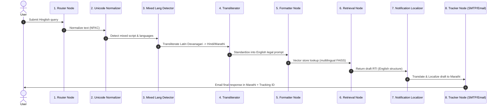

# Walkthrough: Multilingual Query Pipeline Flow

This document provides a step-by-step execution trace of a multilingual request submitted to the Right to Information (RTI) agent system. It details the journey of a query submitted in a mixture of languages and scripts (e.g., Hinglish or Marathi written in the Latin/Roman script), how it is normalized, analyzed, expanded, translated, formatted, and ultimately localized back into the applicant's preferred target language.

---

## 1. Trace Scenario
* **User Input (Hinglish/Devanagari Mix)**: *"road maintenance budget details pcmc pune municipal corporation ke liye chahiye. ward 14 ka details do please."*
* **Applicant**: Rahul (Pune resident, prefers Marathi/Hindi response, queries in Hinglish)
* **Configuration**: `preferred_language = "mr"`, `detected_language = "hi-Latn"`, `target_language = "mr"`

---

## 2. Multilingual Pipeline Sequence Flow

---

## 3. Detailed Step-by-Step Processing

### Step 1: Entry & Normalization (`multilingual/normalization/unicode_normalizer.py`)
* **Actions**:
  * The system receives the raw string: `"road maintenance budget details pcmc pune municipal corporation ke liye chahiye. ward 14 ka details do please."`
  * The **Unicode Normalizer** (`unicode_normalizer.py`) runs standard Unicode **NFKC (Normalization Form Compatibility Decomposition)**. This eliminates stylistic font differences, standardizes special characters, and handles Devanagari character compositions (e.g., matching half-characters or complex ligatures to standard Unicode codepoints).
* **State Evolution**:
  * Input: `raw_query`
  * Output:
    * `normalized_query = "road maintenance budget details pcmc pune municipal corporation ke liye chahiye. ward 14 ka details do please."`

### Step 2: Language & Script Detection (`multilingual/detection/`)
* **Actions**:
  * The **Script Detector** (`script_detector.py`) checks for the script components (returns `Latin` script for the Roman characters and `Devanagari` if Hindi/Marathi native characters are used).
  * The **Language Detector** (`language_detector.py`) and **Mixed Language Detector** (`mixed_language_detector.py`) analyze the token probabilities. It determines that:
    * Primary script is `Latin`.
    * Semantic structure contains standard Hindi stop-words/helping-words (`ke liye chahiye`, `ka details do please`).
    * The input is classified as **Hinglish (`hi-Latn`)** with mixed English vocabulary (`road maintenance`, `budget`, `municipal corporation`).
* **State Evolution**:
  * Input: `normalized_query`
  * Output:
    * `detected_language = "hi-Latn"`
    * `primary_script = "Latin"`
    * `is_mixed_language = True`

### Step 3: Phonetic Transliteration & Query Expansion (`multilingual/transliteration/`)
* **Actions**:
  * The **Transliterator** (`transliterator.py`) converts Latin-transcribed Hinglish/Marathi into Devanagari script.
  * The **Phonetic Mapper** (`phonetic_mapper.py`) maps words like `chahiye` to `चाहिए` and `pune municipal corporation` to its standard phonetic or direct Devanagari equivalent `पुणे महानगरपालिका` / `पुणे नगर निगम`.
  * The **Query Expansion** utility (`query_expansion.py`) expands the search query by appending synonyms in both Hindi and Marathi to ensure high recall during RAG retrieval:
    * Original: `road maintenance budget pcmc`
    * Expanded: `["road maintenance budget", "सड़क मरम्मत बजट", "रस्ता दुरुस्ती अर्थसंकल्प", "PCMC", "पिंपरी चिंचवड महानगरपालिका"]`
* **State Evolution**:
  * Output:
    * `transliterated_query = "रोड मेंटेनेंस बजट डिटेल्स पीसीएमसी पुणे म्युनिसिपल कारपोरेशन के लिए चाहिए। वार्ड १४ का डिटेल्स दो प्लीज।"`
    * `expanded_queries = ["road maintenance budget", "सड़क मरम्मत बजट", "रस्ता दुरुस्ती अर्थसंकल्प", "PCMC"]`

### Step 4: Standardization into English Legal Prompt (`formatter_node`)
* **Actions**:
  * RTI applications in India are most effectively processed and categorized when drafted in a standard, official legal structure (as per Section 6(1) of the RTI Act, 2005).
  * The `formatter_node` takes the normalized, transliterated, and expanded query context and calls the standard drafting prompt to generate a formal RTI draft in **English** (which serves as the primary system-wide processing draft).
* **State Evolution**:
  * Output:
    * `formal_query = "To: Public Information Officer, Pimpri Chinchwad Municipal Corporation (PCMC)... Subject: Budget allocation and expenditure details for road repairs in Ward 14 during fiscal year 2024-2025..."`
    * `detected_department = "Pimpri Chinchwad Municipal Corporation (PCMC)"`

### Step 5: Multi-Vector Multilingual Retrieval (`rag/` & `multilingual/retrieval/`)
* **Actions**:
  * The `retrieval_node` uses the multilingual vector store (`multilingual/retrieval/`) and embeddings module to match queries.
  * The embeddings are computed using `text-embedding-004` (supporting cross-lingual semantic matching).
  * Retrieval is performed across Hindi, Marathi, and English corporate documents stored in the database.
  * It successfully finds:
    * English document: `PCMC_Road_Works_Budget_2024.pdf` (similarity score: `0.87`)
    * Marathi circular: `रस्ते दुरुस्ती मार्गदर्शक तत्त्वे २०२४.html` (similarity score: `0.91`)
  * The system computes similarity values using standard distance metric conversion: `1 / (1 + distance)`.
* **State Evolution**:
  * Output:
    * `retrieved_context = ["PCMC Ward 14 allocated 4.5 Crores for asphalt road resurfacing...", "रस्ते दुरुस्तीसाठी प्रभाग १४ अंतर्गत विशेष निधी वाटप..."]`
    * `retrieval_scores = [0.87, 0.91]`
    * `retrieval_citations = ["PCMC Budget PDF: p.12", "PMC Circular 104-B: p.3"]`

### Step 6: Target Language Localization (`multilingual/localization/`)
* **Actions**:
  * Once the graph processes, debates, and verifies the legal draft and retrieved details, the final response and official notifications must be translated back into the applicant's **preferred language** (`preferred_language = "mr"` - Marathi).
  * The **Notification Localizer** (`notification_localizer.py`) and **UI Localization** module (`ui_localization.py`) leverage structured translation grids.
  * They translate:
    * Legal application structure into formal legal Marathi.
    * Email notifications and status alerts into polite Marathi.
* **State Evolution**:
  * Input: `formal_query` (English), `final_response` (English)
  * Output:
    * `localized_formal_query = "प्रति, जन माहिती अधिकारी, पिंपरी चिंचवड महानगरपालिका... विषय: माहिती अधिकार कायदा २००५ च्या कलम ६(१) अंतर्गत प्रभाग १४ मधील रस्ते दुरुस्तीच्या बजेटबाबत..."`
    * `localized_response = "माहिती अधिकार अर्ज यशस्वीरीत्या तयार करण्यात आला आहे!..."`
    * `email_payload = {"subject": "आपला आरटीआय अर्ज प्राप्त झाला आहे - ट्रॅकिंग आयडी RTI-202605-B88", "body": "नमस्कार राहुल, आपल्या अर्जाचा मसुदा खालीलप्रमाणे आहे..."}`

### Step 7: Final Dispatch (`tracker_node` / SMTP)
* **Actions**:
  * `tracker_node` registers the request with `tracking_id = "RTI-202605-B88"`.
  * It dispatches the localized email payload to Rahul.
  * Saving both standard English and localized Marathi copies to the MongoDB collections for dashboard access and archiving.

---

## 4. Verification & Validation Check
To verify the correctness of the multilingual path:
1. **Unicode Compliance**: NFKC normalization ensures that search keywords like `पुणे` match correctly even if composite Unicode characters (like `पु` followed by standard vowel signs) are typed using different keyboards.
2. **Retrieval Precision**: The hybrid expansions (`expanded_queries`) prevent zero-result rates when users query using mixed jargon (e.g., PCMC vs. पिंपरी चिंचवड).
3. **Translation Preservation**: Under Section 6(1), the localized Marathi draft is perfectly mapped to statutory formats, preserving the legally valid wording needed for municipal submission.
