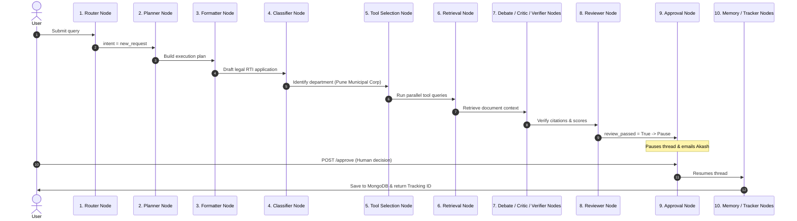

# Walkthrough: Standard New RTI Submission Flow

This document provides a step-by-step execution trace of a user submitting a new Right to Information (RTI) application. It details how the request flows through the graph, how state fields evolve, and how database collections are updated.

---

## 1. Trace Scenario
* **User Input**: *"I want to know how much budget was allocated and spent on road repairs in ward 12 of Pune municipal corporation during 2024."*
* **Applicant**: Akash (Pune resident)
* **Configuration**: `enable_hitl = true` (Human-in-the-loop enabled)

---

## 2. Step-by-Step Execution Trace

---

## 3. Node Transitions & State Evolution

### Step 1: Entry & Intent Detection (`router_node`)
* **State Evolution**:
  * Input: `raw_query = "I want to know..."`
  * Output:
    * `intent = "new_request"`
    * `sanitized_query = "I want to know..."` (Scrubbed and normalized)
    * `detected_language = "en"`
    * `workflow_path = ["router_node"]`
    * `llm_models_used = {"router_node": "llama-3.1-8b-instant"}`
* **Metrics Emitted**: `rti_requests_total{intent="new_request"} = 1`, `rti_agent_duration{agent="router_node"}`

### Step 2: Plan Generation (`planner_node`)
* **State Evolution**:
  * Input: `sanitized_query`
  * Output:
    * `execution_plan = {"subtasks": [...], "retrieval_strategy": "hybrid"}`
    * `selected_tools = ["department_lookup", "policy_search", "hybrid_search"]`
    * `workflow_path = ["router_node", "planner_node"]`

### Step 3: Legal Drafting (`formatter_node`)
* **State Evolution**:
  * Input: `sanitized_query`
  * Output:
    * `formal_query = "To: Public Information Officer... Under Section 6(1)..."` (structured draft)
    * `rti_template = {"subject": "Budget spent on roads...", "timelines": "2024"}`
    * `workflow_path = [..., "formatter_node"]`
    * `llm_models_used = {..., "formatter_node": "llama-3.3-70b-versatile"}`

### Step 4: Department Mapping (`classifier_node`)
* **State Evolution**:
  * Input: `formal_query`
  * Output:
    * `department = "Urban Development Department"`
    * `sub_department = "Pune Municipal Corporation"`
    * `confidence = "high"`
    * `workflow_path = [..., "classifier_node"]`
    * `llm_models_used = {..., "classifier_node": "gemini-1.5-pro"}`
* **Metrics Emitted**: `rti_classification_confidence{confidence="high"} = 1`

### Step 5: Tool Execution (`tool_selection_node`)
* **Actions**: Executes `department_lookup` and `policy_search` in parallel using `asyncio.gather()`.
* **State Evolution**:
  * Input: `selected_tools`
  * Output:
    * `tool_results = [{"tool_name": "department_lookup", "status": "success", "output": [...]}]`
    * `workflow_path = [..., "tool_selection_node"]`

### Step 6: RAG Grounding (`retrieval_node`)
* **Actions**: Queries the FAISS index filtered by `department = "Urban Development Department"`.
* **State Evolution**:
  * Input: `formal_query`, `department`
  * Output:
    * `retrieved_context = ["Pune Municipal Corporation budget allocation rules...", ...]`
    * `retrieval_scores = [0.854, 0.792]`
    * `retrieval_citations = ["PMC Budget Circular: p.4"]`
    * `retrieval_confidence = 0.823`
    * `workflow_path = [..., "retrieval_node"]`
* **Metrics Emitted**: `rti_retrieval_score = 0.823`

### Step 7: Verification & Review (`debate_node` -> `critic_node` -> `verifier_node` -> `reviewer_node`)
* **Actions**:
  * `debate_node` runs multi-agent debate to resolve tool result consistencies.
  * `critic_node` verifies retrieval scores and department confidence metrics.
  * `verifier_node` checks citation validity and enforces municipal policies.
  * `reviewer_node` grades draft legal tone, grounding, and looks for hallucinations using Gemini Pro.
* **State Evolution**:
  * Input: `formal_query`, `retrieved_context`, `retrieval_citations`
  * Output:
    * `review_passed = True`
    * `review_score = 0.94`
    * `grounding_score = 0.96`
    * `hallucination_flags = []`
    * `workflow_path = [..., "reviewer_node"]`

### Step 8: Human-in-the-Loop Interrupt (`approval_node`)
* **Actions**:
  * The node detects `approval_status == "pending"`.
  * It connects to MongoDB and saves the pending snapshot to the `rti_requests` collection with a status of `"awaiting_approval"`.
  * It dispatches an email notification containing the review score and draft text to Akash.
  * The graph runtime halts execution, saving the exact thread state in the SQLite checkpointer.
* **State Evolution**:
  * Output:
    * `status = "awaiting_approval"`
    * `workflow_path = [..., "approval_node:pending"]`

### Step 9: Human Action & Resumption (`approval_node` resume)
* **Actions**:
  * Akash reviews the email, edits a line in the draft (e.g. adding his ward number details), and clicks "Approve".
  * The API handles the request and calls `.resume()`, passing the updated config and the human's inline edit (`edited_query`).
  * The graph hydrates the state and wakes up. `approval_node` executes again. Seeing `approval_status == "approved"`, it applies the human's inline edits to `formal_query` and proceeds.
* **State Evolution**:
  * Input: `approval_status = "approved"`, `edited_query = "..."`
  * Output:
    * `formal_query = "To: PIO, Pune Municipal Corporation... Ward 12 details..."`
    * `approval_timestamp = "2026-05-20T16:12:00Z"`
    * `workflow_path = [..., "approval_node:approved"]`
* **Metrics Emitted**: `rti_approval_decisions{decision="approved"} = 1`

### Step 10: Consensus, Learning & Persistence (`consensus_node` -> `memory_learning_node` -> `tracker_node`)
* **Actions**:
  * `consensus_node` compiles aggregate risk metrics (`risk_score = 0.12`).
  * `memory_learning_node` records the successful execution flow in the episodic FAISS semantic memory.
  * `tracker_node` assigns a unique tracking ID (`RTI-202605-A9D4E2`), saves the completed request to MongoDB, updates the active user thread, and triggers the final email notification to Akash.
* **State Evolution**:
  * Output:
    * `tracking_id = "RTI-202605-A9D4E2"`
    * `status = "submitted"`
    * `final_response = "✅ Your RTI application has been successfully submitted!..."`
    * `workflow_path = [..., "tracker_node"]`
