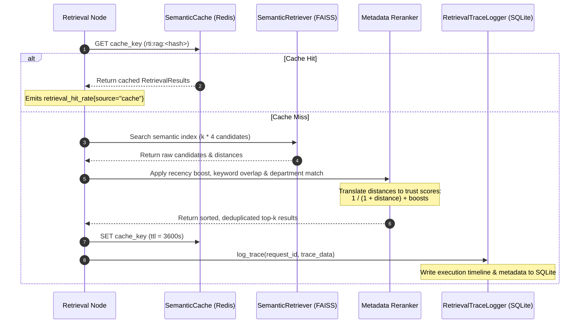

# Walkthrough: Retrieval Diagnostics & Debug Flow

This document details the diagnostic and debugging lifecycle of the hybrid RAG (Retrieval-Augmented Generation) pipeline. It trace-walks how a query is executed, how the Redis-backed Semantic Cache is consulted, how FAISS similarity distances are translated and normalized, how metadata reranking evaluates candidates, and how retrieval traces are written to sqlite for offline replay and diagnostics.

---

## 1. Trace Scenario
* **User Input**: *"What is Pune Municipal Corporation's road digging compensation policy for telecom companies in 2024?"*
* **Target Department**: Pune Municipal Corporation
* **Database State**: Redis is active; the FAISS vector index contains circulars regarding municipal road cutting, utility layout permissions, and restore fees.
* **Request ID**: `5c21df2a-89a1-43e5-9c88-e21b0cd93a52`

---

## 2. Retrieval & Diagnostic Sequence Flow



---

## 3. Step-by-Step Processing & State Changes

### Step 1: Entry & Cache Evaluation (`rag/retrievers/hybrid_retriever.py`)
* **Actions**:
  * The `retrieval_node` receives the query and the inferred target department (`Pune Municipal Corporation`).
  * The system computes a deterministic SHA-256 cache key based on the lowercased query, target department, language, and request parameter `k`:
    `cache_key = rti:rag:8d9f10a8b9c8d7e6f5e4d3c2`
  * The `SemanticCache` performs an asynchronous GET operation on Redis (`redis.asyncio` client).
* **Logs & Metrics**:
  * If found: Emits metric `retrieval_hit_rate{source="cache"} = 1`, logs cache hit, and returns immediately in `1.2ms`.
  * If not found (Cache Miss): Emits metric `retrieval_hit_rate{source="miss"} = 1` and proceeds to FAISS query.

---

### Step 2: Semantic Vector Lookup (`rag/retrievers/semantic_retriever.py`)
* **Actions**:
  * To ensure maximum recall prior to metadata reranking, the retriever queries FAISS for `k * 4` candidates (e.g. if `k = 5`, it retrieves `20` candidates).
  * The system converts the text query to a vector using the standardized `text-embedding-004` model.
  * The FAISS index performs an L2 Euclidean search, returning candidate segments along with L2 distance values.
* **Vector Store Conversion Formula**:
  * To normalize search results into standard similarity trust scores bounded between `0.0` and `1.0`, the system computes:
    $$\text{Score} = \frac{1}{1 + \text{Distance}}$$
  * Raw FAISS candidates returned:
    * Doc A: `PMC Utility Restoration Rules (2022).pdf` — L2 Distance = `0.15` $\rightarrow$ Score = `0.8696`
    * Doc B: `PMC General Budget 2024.pdf` — L2 Distance = `0.34` $\rightarrow$ Score = `0.7463`
    * Doc C: `Pimpri Tree Act Circular.pdf` — L2 Distance = `0.61` $\rightarrow$ Score = `0.6211`

---

### Step 3: Metadata Filtering, Deduplication & Reranking (`_rerank`)
* **Actions**:
  * **Deduplication**: Filters out duplicate text fragments from the same document hash to preserve information diversity within the context window.
  * **Department Alignment Boost**: If a candidate's metadata matches the target department (`Pune Municipal Corporation`), it receives a matching boost of `+0.1` to the score.
  * **Keyword Overlap Score**: Compares query keywords (e.g. `road`, `digging`, `compensation`) with candidates. Doc A matches `road` and `digging` heavily, gaining `+0.05`.
  * **Recency Boost**: Linear exponential decay boost calculated from the document's publication year (gives a subtle boost if the document was published in 2023-2024).
  * The final scores are capped at a maximum value of `1.0`.
* **State Evolution**:
  * **Doc A Final Score**: `0.8696 + 0.1 (PMC Match) + 0.05 (Keywords) + 0.03 (2022 Recency) = 1.0 (Capped)`
  * **Doc B Final Score**: `0.7463 + 0.1 (PMC Match) + 0.01 (Keywords) + 0.05 (2024 Recency) = 0.9063`
  * Candidates are sorted by final score in descending order. The top `k = 5` documents are stored in the state.

---

### Step 4: Trace Logging (`rag/debug/retrieval_trace_logger.py`)
* **Actions**:
  * To enable offline diagnostics, reproducible evaluation, and regression testing, the system logs a high-fidelity diagnostic record to `data/retrieval_traces.db`.
  * It records all inputs, intermediate candidates, metadata scores, filters, and execution timelines.
* **SQLite Record Columns (`traces` table)**:
  * `request_id`: `"5c21df2a-89a1-43e5-9c88-e21b0cd93a52"`
  * `query`: `"What is Pune Municipal Corporation's road digging..."`
  * `configuration`: `{"k": 5, "department": "Pune Municipal Corporation", "use_cache": true}`
  * `top_k_results`: Raw candidates list before reranking.
  * `reranked_results`: Sorted, deduplicated candidates list with final trust scores.
  * `filters_applied`: `{"department": "Pune Municipal Corporation", "language": "en"}`
  * `final_context`: Consolidated markdown text injected into the LLM prompt.
  * `timeline`: Event milestones: `[{"event": "cache_checked", "elapsed_ms": 1.1}, {"event": "vector_queried", "elapsed_ms": 48.7}, {"event": "reranked", "elapsed_ms": 52.3}]`
  * `latency_ms`: `54.2`

---

## 4. Replay & Debugging Scenarios

### Inspecting Retrieval Performance via SQLite
Developers can inspect past RAG failures by running diagnostic queries in the terminal:
```sql
-- Retrieve slow queries (latency > 100ms) that resulted in low trust scores
SELECT request_id, query, latency_ms, reranked_results
FROM traces 
WHERE latency_ms > 100.0 OR final_context LIKE '%No context retrieved%';
```

### Reproducing an Execution Path
Using the logged trace, developers can run a replay script to test if changes in embedding models or metadata boosts improve retrieval scores:
1. Hydrate the SQLite database trace.
2. Load the recorded `configuration` and `query` for a specific `request_id`.
3. Feed the inputs back into `HybridRetriever.retrieve(use_cache=False)`.
4. Assert that the returned `reranked_results` matches or improves upon the original scores, safeguarding against semantic search regression.
