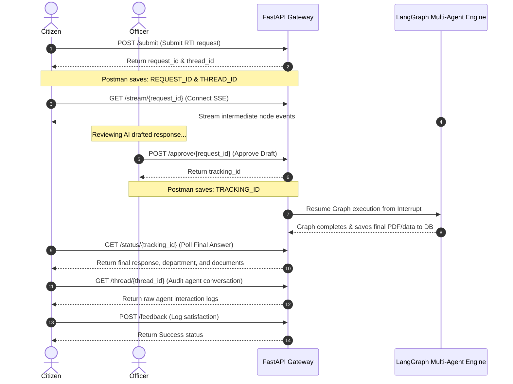

# Chained RTI Lifecycle Integration Testing

This guide details the stateful, automated **Chained Integration Workflows** folder in the Postman collection, which replicates the complete lifecycle of a citizen's Right to Information (RTI) application from submission to approval, streaming, completion, and feedback.

---

## 🔄 The E2E RTI Lifecycle Flow

The multi-agent LangGraph execution is stateful and relies on human-in-the-loop (HITL) approval. The Postman testing collection models this dependency chain using sequential requests that share dynamically captured variables.



---

## ⚙️ Chaining Scripts Breakdown

Here is a technical walkthrough of how Postman automates state transfer between these API steps.

### Step 1: Submission
*   **Action**: Citizens submit a new raw query via `POST /api/v1/submit`.
*   **Postman Test Script**: Extracts the unique execution ID and thread ID, and persists them into the environment variables.
    ```javascript
    var jsonData = pm.response.json();
    pm.test("Status code is 202", function () {
        pm.response.to.have.status(202);
    });
    pm.test("Chaining: Extract REQUEST_ID & THREAD_ID", function () {
        pm.expect(jsonData.request_id).to.be.a("string");
        pm.environment.set("REQUEST_ID", jsonData.request_id);
        if (jsonData.thread_id) {
            pm.environment.set("THREAD_ID", jsonData.thread_id);
        }
    });
    ```

### Step 2: Stream Progression
*   **Action**: Connect to the SSE stream via `GET /api/v1/stream/{{REQUEST_ID}}` to verify that agents are active and generating real-time intermediate reasoning tokens.

### Step 3: Officer Approval
*   **Action**: Officers review the drafted response and submit an approval or correction via `POST /api/v1/approve/{{REQUEST_ID}}`.
*   **Postman Test Script**: Resumes the LangGraph and extracts the tracking ID used to retrieve the final citizen document.
    ```javascript
    var jsonData = pm.response.json();
    pm.test("Status code is 200", function () {
        pm.response.to.have.status(200);
    });
    pm.test("Chaining: Extract TRACKING_ID", function () {
        pm.expect(jsonData.tracking_id).to.be.a("string");
        pm.environment.set("TRACKING_ID", jsonData.tracking_id);
    });
    ```

### Step 4: Status Polling
*   **Action**: Poll the processing status using `GET /api/v1/status/{{TRACKING_ID}}`.
*   **Expected Results**: Validates that the graph has transitioned to `"completed"`, and displays the final formal RTI document text and selected department.

### Step 5: Transcript Audit
*   **Action**: Fetch the complete transcript history thread using `GET /api/v1/thread/{{THREAD_ID}}`.
*   **Expected Results**: Validates that the internal conversational logs of the agent teams (e.g. classification agent, search agent, critic agent) are recorded and readable.

### Step 6: Feedback Logging
*   **Action**: Citizens log their experience rating using `POST /api/v1/feedback`.
*   **Expected Body**:
    ```json
    {
      "tracking_id": "{{TRACKING_ID}}",
      "rating": 5,
      "comments": "Successfully completed integration flow test."
    }
    ```

---

## 🏃 How to Run the Chained Test

1. Click on the **Chained Integration Workflows** folder inside the collection list.
2. Click the **Run** button at the top of the folder view.
3. Keep the default execution order (Step 1 ➔ Step 6).
4. Click **Run RTI-Agent API Testing Suite**.
5. Postman will execute all requests sequentially, auto-fill the IDs in real-time, and display a report showing all 18 assertions passing!
